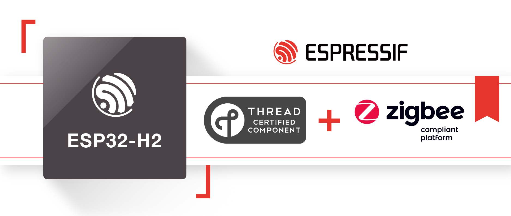

3. Zigbee Certification
=======================

3.1 Espressif Zigbee Platform certification
-------------------------------------------

Espressif Systems `ESP32-H2 <https://www.espressif.com/en/news/ESP32_H2/>`__ has been certified as a "Zigbee-Compliant Platform", according to the relevant certification issued by CSA (Connectivity Standards Alliance). See `Certification <https://csa-iot.org/csa_product/esp32-h2/>`__. Therefore, it has been formally acknowledged that ESP32-H2 provides users with rigorously-tested Zigbee solutions.

Additionally, `ESP32-H2 <https://www.espressif.com/en/news/ESP32_H2/>`__ has been granted the official "Thread Interoperability Certificate", which ensures that ESP32-H2 has passed the all the necessary tests for compliance and interoperability with market-leading, Thread-reference implementations.

3.2 Espressif Zigbee Production certification
---------------------------------------------

Please refer to the `ZUTH <https://csa-iot.org/certification/tools/zuth/>`__ tools.
