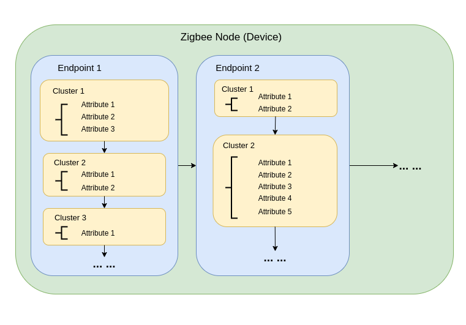
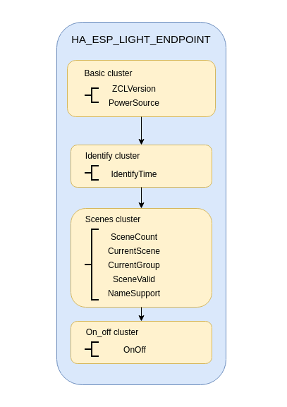
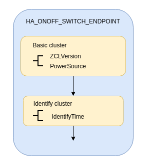
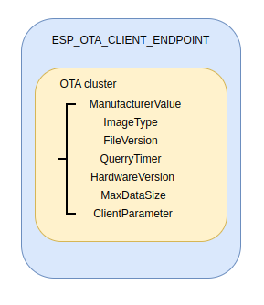
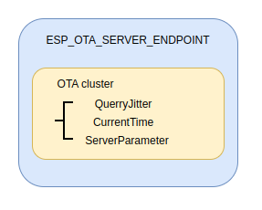
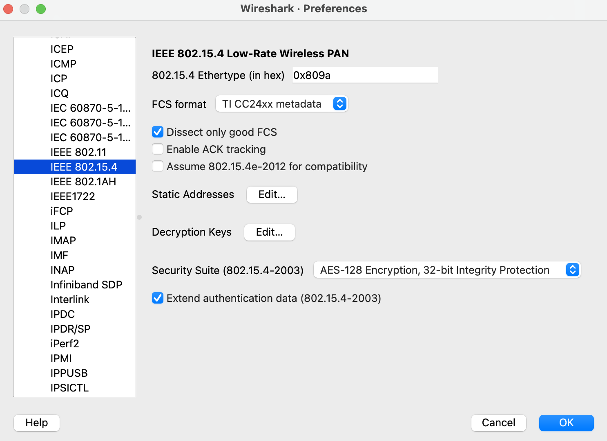
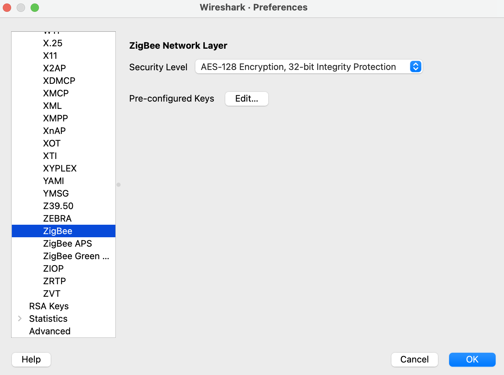
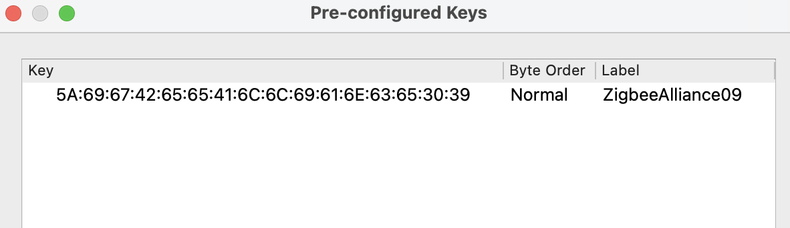

2. Developing with ESP Zigbee SDK
=================================

Please refer the :project_file:`Release Notes <RELEASE_NOTES.md>` to know more about ESP Zigbee SDK releases. Check :project_file:`README <README.md>` to know more details.

2.1 Development Setup
---------------------

This section talks about setting up your development environment, fetching the Git repositories, and instructions to build and flash.

2.1.1 Setting up the Repositories
~~~~~~~~~~~~~~~~~~~~~~~~~~~~~~~~~
Follow the `ESP-IDF getting started guide <https://docs.espressif.com/projects/esp-idf/en/latest/esp32/get-started/index.html>`_ to set up the IDF development environment. For beginners, please check `Installation Step by Step <https://docs.espressif.com/projects/esp-idf/en/v5.1.3/esp32h2/get-started/linux-macos-setup.html#installation-step-by-step>`_ for esp-idf.

Cloning esp-idf:

.. code-block:: bash

   git clone --recursive https://github.com/espressif/esp-idf.git
   cd esp-idf
   git checkout v5.1.3
   git submodule update --init --recursive
   ./install.sh
   source ./export.sh
   cd ..

Cloning esp-zigbee-sdk:

.. code-block:: bash

   git clone https://github.com/espressif/esp-zigbee-sdk.git

2.1.2 Build and Flash the Applications
~~~~~~~~~~~~~~~~~~~~~~~~~~~~~~~~~~~~~~

Various Zigbee examples are provided with the SDK:

-  :project:`Zigbee Examples <examples>`

Under an example folder, choose IDF SoC target.

::

   idf.py set-target {IDF_TARGET_PATH_NAME}

-  If IDF target has not been set explicitly, then ``esp32`` is
   considered as default.

Build and flash the example.

::

   idf.py -p PORT erase_flash flash monitor

2.2 Running example
-------------------

See the examples readme for more details: :project_file:`README <examples/README.md>`

2.3 Developing your Product
---------------------------

2.3.1 Data Model
~~~~~~~~~~~~~~~~

Understanding the structure before actually modifying and customizing
the device is helpful.

    
Node
^^^^
A node is a single ESP32-H2 based product. It represents a network node in the Zigbee network. A single node can expose multiple endpoints.

Endpoints
^^^^^^^^^

Within each node are endpoints. Endpoints, identified by a number between 1 and 240, define each application running in a ZigBee node (yes, a single ZigBee node can run multiple applications).
Endpoints serve three purposes in ZigBee:

- Endpoints allow for different application profiles to exist within each node.
- Endpoints allow for separate control points to exist within each node.
- Endpoints allow for separate devices to exist within each node.

Clusters
^^^^^^^^

Clusters, defined by a 16-bit identifier, are application objects. Whereas the NwkAddr and endpoint are addressing concepts, the cluster defines application meaning.

- An endpoint can have multiple clusters.
- Clusters, in addition to the identifier, have direction. In the SimpleDescriptor which describes an endpoint, a cluster is listed as either input or output.
- Clusters contain both code (commands) and data (attributes). Commands cause action. Attributes keep track of the current state of that cluster.

Attributes
^^^^^^^^^^

Attributes are identified by a 16-bit number, store the current “state” of a given cluster. A data entity which represents a physical quantity or state.

- A cluster can have multiple attributes.
- There are generic ZCL commands to read and write attributes on any given cluster.
- Attributes can even be set up to report automatically at regular intervals, if they change, or both.

2.3.2 A HA_on_off_light example
~~~~~~~~~~~~~~~~~~~~~~~~~~~~~~~

This section demonstrates how a Home Automation (HA) on_off_light example creates as reference.

See example: :project_file:`HA_on_off_light <examples/esp_zigbee_HA_sample/HA_on_off_light/main/esp_zb_light.c>`

2.3.2.1 Data Model
^^^^^^^^^^^^^^^^^^
In the standard HA_on_off_light example, we use :cpp:func:`esp_zb_on_off_light_ep_create` to create a HA on off single endpoint.

Data model looks like:

Above is the endpoint list we created, then we use :cpp:func:`esp_zb_device_register` to register a Zigbee device.

2.3.2.2 Attribute Callback
^^^^^^^^^^^^^^^^^^^^^^^^^^

An attribute change callback is registered in :cpp:func:`esp_zb_device_add_set_attr_value_cb` to allow user get notification that certain attributes has changed.

It depends on user how to process those attribute changes based on different circumstances, see the example to handle on_off LED light.

.. code-block:: c

   void attr_cb(uint8_t status, uint8_t endpoint, uint16_t cluster_id, uint16_t attr_id, void *new_value)
   {
    if (cluster_id == ESP_ZB_ZCL_CLUSTER_ID_ON_OFF) {
        uint8_t value = *(uint8_t*)new_value;
        if (attr_id == ESP_ZB_ZCL_ATTR_ON_OFF_ON_OFF_ID) {
            /* implemented light on/off control */
            ESP_LOGI(TAG, "on/off light set to %hd", value);
            light_driver_set_power((bool)value);
        }
    } else {
        /* Implement some actions if needed when other cluster changed */
        ESP_LOGI(TAG, "cluster:0x%x, attribute:0x%x changed ", cluster_id, attr_id);
    }
   }

2.3.2.3 Zigbee stack Configuring and starting
^^^^^^^^^^^^^^^^^^^^^^^^^^^^^^^^^^^^^^^^^^^^^
In this example, a Zigbee end-device is configured to HA_on_off_light. :c:macro:`ESP_ZB_ZED_CONFIG()` , see :cpp:type:`esp_zb_cfg_t` definition in the API reference chapter below.

Initialize Zigbee stack by using :cpp:func:`esp_zb_init`, start Zigbee stack by using :cpp:func:`esp_zb_start` and main loop of the Zigbee stack by using :cpp:func:`esp_zb_main_loop_iteration`.

After Zigbee stack is running, by checking different signals that stack provided, user could start BDB commissioning by using :cpp:func:`esp_zb_bdb_start_top_level_commissioning`.

2.3.3 A HA_on_off_switch example
~~~~~~~~~~~~~~~~~~~~~~~~~~~~~~~~

This section demonstrates how a Home Automation (HA) on_off_switch example creates as reference.

See example: :project_file:`HA_on_off_switch <examples/esp_zigbee_HA_sample/HA_on_off_switch/main/esp_zb_switch.c>`

2.3.2.1 Data Model
^^^^^^^^^^^^^^^^^^
In the standard HA_on_off_light example, we use :cpp:func:`esp_zb_on_off_switch_ep_create` to create a HA on off single endpoint.

Data model looks like:

Above is the endpoint list we created, then we use :cpp:func:`esp_zb_device_register` to register a Zigbee device.

2.3.2.2 ZCL commands
^^^^^^^^^^^^^^^^^^^^
Varieties of ZCL commands is provided in the :project_file:`esp_zigbee_zcl_command <components/esp-zigbee-lib/include/zcl/esp_zigbee_zcl_command.h>`.

In this example we demonstrate a ZCL on_off_toggle command.

After button on the board is pressed, the :cpp:func:`esp_zb_buttons_handler` creates a on_off toggle command :cpp:func:`esp_zb_zcl_on_off_cmd_req`. The user has to provide a remote node endpoint, local node endpoint, destination short address, and command type to pack the command request. See :cpp:type:`esp_zb_zcl_on_off_cmd_t`.

.. code-block:: c

   static void esp_zb_buttons_handler(switch_func_pair_t *button_func_pair)
   {
       if (button_func_pair->func == SWITCH_ONOFF_TOGGLE_CONTROL) {
           /* implemented light switch toggle functionality */
           esp_zb_zcl_on_off_cmd_t cmd_req;
           cmd_req.zcl_basic_cmd.dst_addr_u.addr_short = on_off_light.short_addr;
           cmd_req.zcl_basic_cmd.dst_endpoint = on_off_light.endpoint;
           cmd_req.zcl_basic_cmd.src_endpoint = HA_ONOFF_SWITCH_ENDPOINT;
           cmd_req.address_mode = ESP_ZB_APS_ADDR_MODE_16_ENDP_PRESENT;
           cmd_req.on_off_cmd_id = ESP_ZB_ZCL_CMD_ON_OFF_TOGGLE_ID;
           ESP_EARLY_LOGI(TAG, "send 'on_off toggle' command");
           esp_zb_zcl_on_off_cmd_req(&cmd_req);
       }
   }

2.3.2.3 Zigbee stack Configuring and starting
^^^^^^^^^^^^^^^^^^^^^^^^^^^^^^^^^^^^^^^^^^^^^
In this example, a Zigbee coordinator is configured to HA_on_off_switch. :c:macro:`ESP_ZB_ZC_CONFIG()`, see :cpp:type:`esp_zb_cfg_t` definition in the API reference chapter below.

Initialize Zigbee stack by using :cpp:func:`esp_zb_init`, start Zigbee stack by using :cpp:func:`esp_zb_start` and main loop of the Zigbee stack by using :cpp:func:`esp_zb_main_loop_iteration`.

After Zigbee stack is running, by checking different signals that stack provided, user could start BDB commissioning by using :cpp:func:`esp_zb_bdb_start_top_level_commissioning`.

2.3.4 An OTA_Upgrade example
~~~~~~~~~~~~~~~~~~~~~~~~~~~~
This section demonstrates OTA upgrade process in client and server sides and how to create ota_file.bin as reference.

See example:

:project_file:`ota_client <examples/esp_zigbee_ota/ota_client/main/esp_ota_client.c>`

:project_file:`ota_server <examples/esp_zigbee_ota/ota_server/main/esp_ota_server.c>`

2.3.4.1 Data Model
^^^^^^^^^^^^^^^^^^
Client Data Model:

In the client side, we use :cpp:func:`esp_zb_ep_list_add_ep` to add ESP_OTA_CLIENT_ENDPOINT to endpoint list.

We create client cluster and add client attribute use :cpp:func:`esp_zb_ota_cluster_create` and we create client parameters use :cpp:func:`esp_zb_ota_client_parameter`.

The :cpp:type:`esp_zb_ota_cluster_cfg_t` contains mandatory attributes for OTA client and the :cpp:type:`esp_zb_ota_upgrade_client_parameter_t` contains parameters for OTA client.

The details and definitions see in the API reference chapter below.

Data model looks like:

Server Data Model:

In the server side, we use :cpp:func:`esp_zb_ep_list_add_ep` to add ESP_OTA_SERVER_ENDPOINT to endpoint list.

We create server cluster and add server parameters use :cpp:func:`esp_zb_ota_server_parameter`. The :cpp:type:`esp_zb_ota_upgrade_server_parameter_t` contains parameters for OTA server.

The details and definitions see in the API reference chapter below.

Data model looks like:

Configure the OTA server for initialization with :c:macro:`ESP_ZB_OTA_CONFIG()`, see :cpp:type:`esp_zb_ota_cfg_t` definition in the API reference chapter below.

Initialize the OTA cluster (server part) and load the ota file by using :cpp:func:`esp_zb_ota_server_init`. OTA server starts and insert ota file to upgrade mechanism by using :cpp:func:`esp_zb_ota_server_start`.

2.3.4.2 OTA Upgrade Process
^^^^^^^^^^^^^^^^^^^^^^^^^^^
- After server starts, server send OTA image notify (20 sec after startup - it is scheduled in application) to client. Then client send the query image request to server.
- On receipt of the query image request, server initializes by loading the client that holds the three field values (manufacturer code, image type and new file version). If the client values matches with server values, server send response back to client. Otherwise, it shall discard the command and no further processing shall continue.

Following diagram explains the OTA upgrade process in detail:

.. figure:: ../_static/zigbee-ota-upgrade-process.png
    :align: center
    :alt: ESP Zigbee OTA Upgrade
    :figclass: align-center

- There will be ``OTA_UPGRADE_OFFSET_TIME``, calculated by the difference between upgrade time and current time and use it as upgrade delay between client finished receiving image from server and start to apply new image.
- Server gets the upgrade bin file (ota_file.bin) and transmit it through OTA process. After OTA finish, the client receive the upgrade bin file and trigger restart. For details see the esp_ota_client :project_file:`README <examples/esp_zigbee_ota/ota_client/README.md>`.
- It would take approximately 15-20 minutes to complete the OTA upgrade process with default upgrade bin file (ota_file.bin). Time will be varies depends on the size of the ota upgrade image file.

2.3.4.3 ota_file.bin
^^^^^^^^^^^^^^^^^^^^
ota_file.bin is upgrade bin file for client side to upgrade, bin file can be generated by compiling any other user project. Default name is (ota_file.bin) that corresponds to the name and type configured in :project_file:`esp_ota_server.h <examples/esp_zigbee_ota/ota_server/main/esp_ota_server.h>` and place it under :project:`ota_server <examples/esp_zigbee_ota/ota_server>`.

Default upgrade bin file (ota_file.bin) is only valid for target ``esp32h2``. It is just for demo purpose.

The user has to provide the upgrade file for client side if they want to upgrade based on their project and target selected. Place it under :project:`ota_server <examples/esp_zigbee_ota/ota_server>`. The filename and filetype should corresponds to file configuration in :project_file:`esp_ota_server.h <examples/esp_zigbee_ota/ota_server/main/esp_ota_server.h>` by modifying it accordingly.

2.3.4.4 Partition Table
^^^^^^^^^^^^^^^^^^^^^^^
The OTA example use a pre-defined partition table which supports two app partitions: ``factory`` and ``OTA_0``. Please refer to :project_file:`partitions <examples/esp_zigbee_ota/ota_client/partitions.csv>` for more information.

On first boot, the bootloader will load the image contained on the ``factory`` partition (i.e. the example image). This triggers an OTA upgrade. A new image will save into the ``OTA_0`` partition. Next, it updates the ``ota_data`` partition to indicate which image should boot after the next reset. Upon reset, the bootloader reads the contents of the ``ota_data`` partition to determine which image is selected to upgrade.

2.3.4.5 OTA Upgrade Status Callback
^^^^^^^^^^^^^^^^^^^^^^^^^^^^^^^^^^^
OTA upgrade status callback for client is registered in :cpp:func:`esp_zb_device_add_ota_upgrade_status_cb` to allow the user get OTA upgrade process status. See :cpp:type:`esp_zb_zcl_ota_upgrade_status_t`.

.. code-block:: c

   static void esp_zb_ota_upgrade_status_cb (esp_zb_zcl_ota_upgrade_status_t status)
   {
      ESP_LOGI(TAG, "OTA upgrade status:%d", status);
   }

2.3.4.6 Zigbee Stack Configuring and Starting
^^^^^^^^^^^^^^^^^^^^^^^^^^^^^^^^^^^^^^^^^^^^^
In this example, a Zigbee end-device is configured to ota_client :c:macro:`ESP_ZB_ZED_CONFIG()` and a Zigbee coordinator is configured to ota_server :c:macro:`ESP_ZB_ZC_CONFIG()`, see :cpp:type:`esp_zb_cfg_t` definition in the API reference chapter below.

Initialize Zigbee stack by using :cpp:func:`esp_zb_init`, start Zigbee stack by using :cpp:func:`esp_zb_start` and main loop of the Zigbee stack by using :cpp:func:`esp_zb_main_loop_iteration`.

After Zigbee stack is running, by checking different signals that stack provided, user could start BDB commissioning by using :cpp:func:`esp_zb_bdb_start_top_level_commissioning`.

.. todo::
   2.3.5 Adding customized devices

2.4 Debugging
-------------

If you encounter any functionality issues with the Zigbee SDK, the following debugging tips may be helpful.

2.4.1 Zigbee API Lock
~~~~~~~~~~~~~~~~~~~~~

The Zigbee SDK APIs are not thread-safe, so it's mandatory to acquire the lock before calling any Zigbee APIs, except for the following cases:

- The call site is in Zigbee callbacks which are from Zigbee task.
- Calling the schedule alarm APIs, which include `esp_zb_scheduler_alarm()` and `esp_zb_scheduler_alarm_cancel()`.

An example code block:

.. code-block:: c

   #include "esp_zigbee_core.h"

   void application_task(void *pvParameters)
   {
      ......
      esp_zb_lock_acquire(portMAX_DELAY);

      esp_zb_zcl_on_off_cmd_req(cmd_req);

      esp_zb_lock_release();
      ......
   }

The same lock is acquired in `esp_zb_main_loop_iteration()` when the Zigbee task is not idle.

2.4.2 Stack Size
~~~~~~~~~~~~~~~~

Insufficient stack size often leads to unexpected runtime issues, you may use `uxTaskGetStackHighWaterMark() <https://docs.espressif.com/projects/esp-idf/en/latest/esp32/api-reference/system/freertos_idf.html#_CPPv427uxTaskGetStackHighWaterMark12TaskHandle_t>`_ FreeRTOS API to monitor the stack usage of tasks.

2.4.3 Sniffer and Wireshark
~~~~~~~~~~~~~~~~~~~~~~~~~~~

Analyzing the packet flow captured by a sniffer is an effective method for understanding Zigbee protocol and troubleshooting issues.

To setup a sniffer for 802.15.4, you'll require the following:

- A host machine running `Pyspinel <https://openthread.io/guides/pyspinel>`_ and `Wireshark <https://www.wireshark.org/>`_
- A 802.15.4 enabled devkit (ESP32-H2, ESP32-C6, etc) running `ot_rcp <https://github.com/espressif/esp-idf/tree/master/examples/openthread/ot_rcp>`_

Follow the steps in `Packet Sniffing with Pyspinel <https://openthread.io/guides/pyspinel/sniffer>`_ to set up the sniffer.

Please note that the Wireshark configuration provided in the link above is intended for the Thread protocol. For Zigbee, you'll need to make the following configuration:

1. Go to the Wireshark **Preferences** > **Protocols** > **IEEE 802.15.4**, configure the 802.15.4 as bellow:

2. Go to the Wireshark **Preferences** > **Protocols** > **ZigBee**:

3. Add the Pre-configured keys for packet decryption, the default key in the examples is `5A:69:67:42:65:65:41:6C:6C:69:61:6E:63:65:30:39` ("ZigbeeAlliance09")

Now you can check the Zigbee packet flow in Wireshark.

2.4.4 Enable Debug Mode and Trace Logging
~~~~~~~~~~~~~~~~~~~~~~~~~~~~~~~~~~~~~~~~~

By default, the release version libraries are used for building. Enable `ZB_DEBUG_MODE` option to use debug version libraries instead, which will output more logs for debugging.

The stack trace logging feature outputs additional logs, here take the :project:`HA_on_off_light <examples/esp_zigbee_HA_sample/HA_on_off_light>` as an example. To enable trace logging, follow these steps:

1. Navigate to the example directory and run the command:

.. code-block:: bash

   idf.py menuconfig

2. Go to **Component config** > **Zigbee** > **Zigbee Enable** > **Zigbee Debug Mode**, enable the ``Zigbee Debug Mode`` option.

3. Call :cpp:func:`esp_zb_set_trace_level_mask` before :cpp:func:`esp_zb_init` to configure the trace level and mask. Please refer to `esp_zigbee_trace.h <https://github.com/espressif/esp-zigbee-sdk/blob/main/components/esp-zigbee-lib/include/esp_zigbee_trace.h>`_ for the masks.

.. code-block:: c

   #include "esp_zigbee_trace.h"

   static void esp_zb_task(void *pvParameters)
   {
   #if CONFIG_ESP_ZB_TRACE_ENABLE
      esp_zb_set_trace_level_mask(ESP_ZB_TRACE_LEVEL_CRITICAL, ESP_ZB_TRACE_SUBSYSTEM_MAC | ESP_ZB_TRACE_SUBSYSTEM_APP);
   #endif

      /* initialize Zigbee stack */
      esp_zb_cfg_t zb_nwk_cfg = ESP_ZB_ZED_CONFIG();
      esp_zb_init(&zb_nwk_cfg);
      ......
   }

4. Enabling trace logging will increase code size. You may need to increase `factory` partition size in the ``partitions.csv`` file:

.. code-block:: bash

   # Name,   Type, SubType, Offset,  Size, Flags
   nvs,        data, nvs,      0x9000,  0x6000,
   phy_init,   data, phy,      0xf000,  0x1000,
   factory,    app,  factory,  , 1200K,
   zb_storage, data, fat,      , 16K,
   zb_fct,     data, fat,      , 1K,

5. Excessive logging can lead to watchdog timeout for the idle task. Therefore, temporarily disable the idle task watchdog:

.. only:: esp32 or esp32s3

    ::

        `ESP_TASK_WDT_CHECK_IDLE_TASK_CPU0` and `ESP_TASK_WDT_CHECK_IDLE_TASK_CPU1`.

.. only:: esp32c3 or esp32c2 or esp32c6 or esp32h2

    ::

        `ESP_TASK_WDT_CHECK_IDLE_TASK_CPU0`.

Finally, build and run the example. You will now see more debugging logs in the output.

2.4.5 Assertion Failures
~~~~~~~~~~~~~~~~~~~~~~~~

There are certain assertions in the SDK that prevent the stack from running into specific situations. Typically, logs and backtraces from `idf.py monitor` help identify the location of the assertion issue, so you may figure out what's wrong with the implementation.

However, this approach may not be effective when the assertion occurs in the Zigbee library due to incomplete debug information in the library. In such cases, you can assist in debugging by sharing us the logs along with the corresponding ELF file (it's within the project `build` folder after compilation, e.g., build/on_off_light_bulb.elf).

Please capture the entire log using a serial tool like `screen`` or `minicom`. The output will resemble the following:

.. code-block:: c

   ^[[0;32mI (579) ESP_ZB_ON_OFF_LIGHT: Start network steering^[[0m
   ^[[0;32mI (2959) ESP_ZB_ON_OFF_LIGHT: Network steering was not successful (status: ESP_FAIL)^[[0m

   assert failed: esp_zb_app_signal_handler esp_zb_light.c:70 (false)
   Core  0 register dump:
   MEPC    : 0x4080063e  RA      : 0x408074c6  SP      : 0x4084f090  GP      : 0x4080d5a0
   TP      : 0x4083e428  T0      : 0x37363534  T1      : 0x7271706f  T2      : 0x33323130
   S0/FP   : 0x00000085  S1      : 0x00000001  A0      : 0x4084f0cc  A1      : 0x4080da59
   A2      : 0x00000001  A3      : 0x00000029  A4      : 0x00000001  A5      : 0x40817000
   A6      : 0x00000004  A7      : 0x76757473  S2      : 0x00000009  S3      : 0x4084f1e2
   S4      : 0x4080da58  S5      : 0x00000000  S6      : 0x00000000  S7      : 0x00000000
   S8      : 0x00000000  S9      : 0x00000000  S10     : 0x00000000  S11     : 0x00000000
   T3      : 0x6e6d6c6b  T4      : 0x6a696867  T5      : 0x66656463  T6      : 0x62613938
   MSTATUS : 0x00001881  MTVEC   : 0x40800001  MCAUSE  : 0x00000007  MTVAL   : 0x00000000
   MHARTID : 0x00000000

   Stack memory:
   4084f090: 0x40809aa6 0x40809ad2 0x42073910 0x4080bdea 0x4080dd04 0x42073910 0x4080dce8 0x4207382c
   4084f0b0: 0x4080dd14 0x4084f0c4 0x4080dd18 0x4207381c 0x4080da58 0x00003037 0x4084f520 0x65737361
   4084f0d0: 0x66207472 0x656c6961 0x65203a64 0x7a5f7073 0x70615f62 0x69735f70 0x6c616e67 0x6e61685f
   4084f0f0: 0x72656c64 0x70736520 0x5f627a5f 0x6867696c 0x3a632e74 0x28203037 0x736c6166 0x42002965
   4084f110: 0x00000000 0xffffffff 0x4080f198 0x4084f368 0x00000008 0x4084f158 0x00000003 0x42004ce4
   4084f130: 0x00000000 0x00000000 0x00000000 0x0000004b 0x4080f759 0x00000000 0x00000339 0x4204ba5e
   4084f150: 0x420737d0 0x420734b4 0x00000042 0x4204be28 0x40850000 0x4084f1e8 0x4080f759 0x4201f83a
   4084f170: 0x00000019 0x00000000 0x00000042 0x4201ebb6 0x00000000 0x00000000 0x0000004d 0x000000c0
   4084f190: 0x00000019 0x00000000 0x00000000 0x42000000 0x4084fd94 0x40850000 0x0000004d 0x000000c0
   4084f1b0: 0x00000019 0xffffffff 0x00000b8f 0x4200756e 0x00000000 0x00001800 0x40817944 0x40800a9c
   4084f1d0: 0x00000008 0x4084f208 0x00000003 0x000000c0 0x00001800 0x00000008 0x00000019 0x40800b1c
   4084f1f0: 0x00000000 0x00000000 0x00000000 0x00000000 0x00000000 0x00000000 0x0000004d 0x000000c0
   4084f210: 0x00000019 0xffffffff 0x4084fd94 0x4200cc44 0x00000000 0x00000000 0x000000aa 0x408107d8
   4084f230: 0x00000000 0x00000000 0x00000019 0x4203bc0c 0x00000001 0x00000001 0x00000001 0x4201f05a
   4084f250: 0x00000000 0x4203bbb2 0x00190000 0x404f4d19 0x00000000 0x00000000 0x00000000 0x00000000
   4084f270: 0x00000000 0x00000000 0x00000000 0x4203b852 0x00000000 0x00000000 0x4084fd74 0x4200ca7e
   4084f290: 0x00000000 0x00000000 0x00000000 0x42007178 0x00000008 0x00000000 0x00000000 0x00000000
   4084f2b0: 0x00000002 0x00000000 0x00000006 0x00000bb8 0x00000000 0x00000000 0x00000000 0x4080995a
   4084f2d0: 0x00000000 0x00000000 0x00000000 0x00000000 0x00000000 0x00000000 0x00000000 0x00000000
   4084f2f0: 0x00000000 0xa5a5a5a5 0xa5a5a5a5 0xa5a5a5a5 0xa5a5a5a5 0xa5a5a5a5 0x00000154 0x4084f0e0
   4084f310: 0x000000f4 0x4080e534 0x4080e534 0x4084f30c 0x4080e52c 0x00000014 0x4084fe34 0x4084fe34
   4084f330: 0x4084f30c 0x00000000 0x00000005 0x4084e308 0x6267695a 0x6d5f6565 0x006e6961 0x00000000
   4084f350: 0x00000000 0x4084f300 0x00000005 0x00000001 0x00000000 0x00000000 0x00000009 0x40817bf4
   4084f370: 0x40817c5c 0x40817cc4 0x00000000 0x00000000 0x00000001 0x00000000 0x00000000 0x00000000
   4084f390: 0x4205ef9e 0x00000000 0x00000000 0x00000000 0x00000000 0x00000000 0x00000000 0x00000000
   4084f3b0: 0x00000000 0x00000000 0x00000000 0x00000000 0x00000000 0x00000000 0x00000000 0x00000000
   4084f3d0: 0x00000000 0x00000000 0x00000000 0x00000000 0x00000000 0x00000000 0x00000000 0x00000000
   4084f3f0: 0x00000000 0x00000000 0x00000000 0x00000000 0x00000000 0x00000000 0x00000000 0x00000000
   4084f410: 0x00000000 0x00000000 0x00000000 0x00000000 0x00000000 0x00000000 0x00000000 0x00000000
   4084f430: 0x00000000 0x00000000 0x00000000 0x00000000 0x00000000 0x00000000 0x00000000 0x00000000
   4084f450: 0x00000000 0x00000000 0x00000000 0x40000000 0x00000054 0x00000000 0x4084f464 0x4084f30c
   4084f470: 0x00000001 0x00000000 0x4084f47c 0xffffffff 0x4084f47c 0x4084f47c 0x00000000 0x4084f490

.. note::

   If you encounter any difficulties and require assistance, please don't hesitate to open a `Github issue <https://github.com/espressif/esp-zigbee-sdk/issues>`_ and include the sniffer capture file, logs and the ELF file.
   Alternatively，please contact us via `technical-inquiries <https://www.espressif.com/en/contact-us/technical-inquiries>`_.
