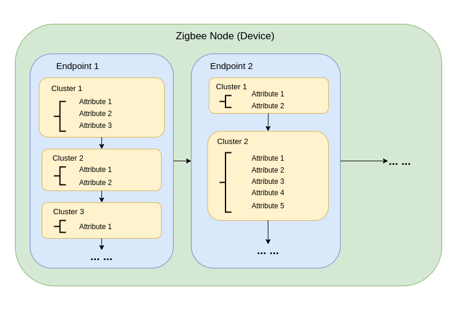
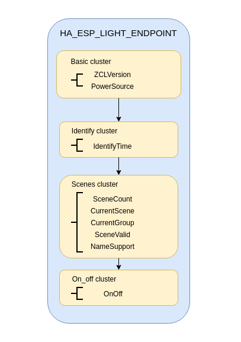
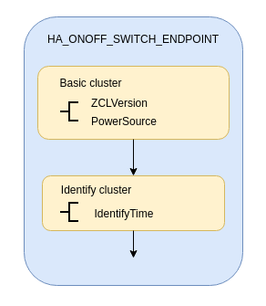
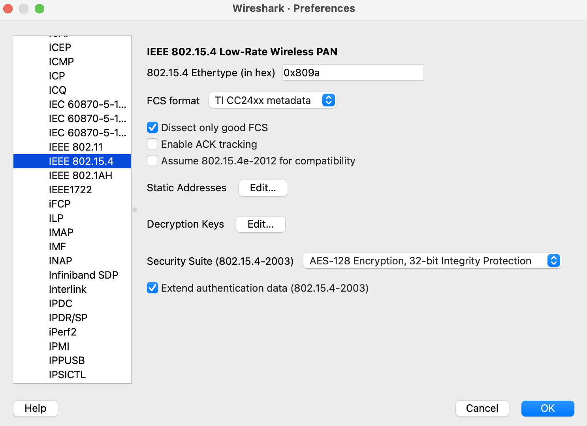
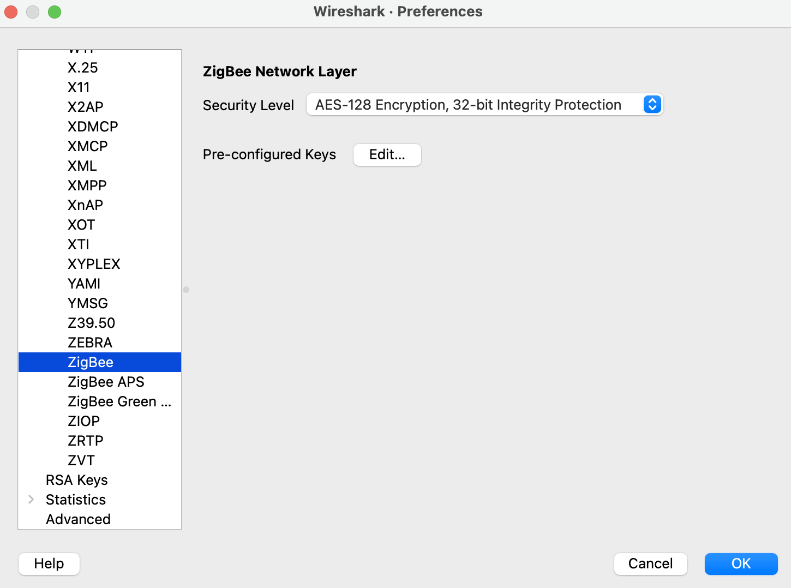
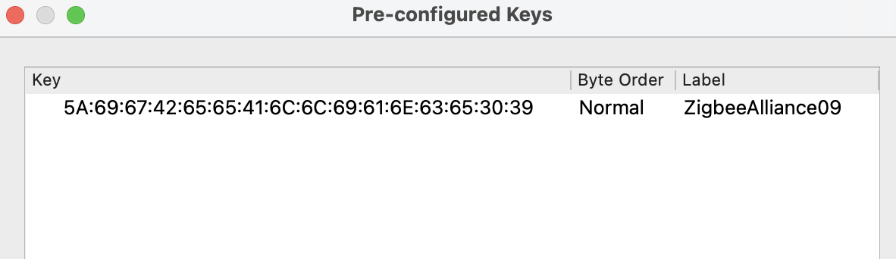

Developing with ESP Zigbee SDK
==============================

Please refer to the :project_file:`Release Notes <RELEASE_NOTES.md>` to know more about ESP Zigbee SDK releases. See :project_file:`README <README.md>` for more details.

Development Setup
-----------------

This section talks about setting up your development environment, fetching the Git repositories, and instructions to build and flash.

Setting up the Repositories
~~~~~~~~~~~~~~~~~~~~~~~~~~~
Follow the `ESP-IDF getting started guide <https://docs.espressif.com/projects/esp-idf/en/latest/esp32/get-started/index.html>`_ to set up the IDF development environment. For beginners, please check `Installation Step by Step <https://docs.espressif.com/projects/esp-idf/en/v5.5.4/esp32h2/get-started/linux-macos-setup.html#installation-step-by-step>`_ for esp-idf.

Cloning esp-idf:

.. code-block:: bash

   git clone --recursive https://github.com/espressif/esp-idf.git

Check out to ESP-IDF v5.5.4, do installation and export the environment:

.. code-block:: bash

   cd esp-idf

   git checkout v5.5.4

   git submodule update --init --recursive

   ./install.sh

   source ./export.sh

Cloning esp-zigbee-sdk:

.. code-block:: bash

   cd ..

   git clone https://github.com/espressif/esp-zigbee-sdk.git

Build and Flash the Applications
~~~~~~~~~~~~~~~~~~~~~~~~~~~~~~~~

Various :project:`Zigbee Examples <examples>` are provided with the SDK. Under an example folder, choose IDF SoC target.
If IDF target has not been set explicitly, then ``esp32`` is considered as default.

.. code-block:: bash

   idf.py set-target {IDF_TARGET_PATH_NAME}

Build and flash the example.

.. code-block:: bash

   idf.py -p PORT erase_flash flash monitor

Running examples
----------------

See the examples README for more details: :example_file:`README <README.md>`

Developing your Product
-----------------------

Data Model
~~~~~~~~~~

Understanding the structure before actually modifying and customizing
the device is helpful.

Node
^^^^
A node is a single ESP32-H2 based product. It represents a network node in the Zigbee network. A single node can expose multiple endpoints.

Endpoints
^^^^^^^^^

Within each node are endpoints. Endpoints, identified by a number between 1 and 240, define each application running in a ZigBee node (yes, a single ZigBee node can run multiple applications).
Endpoints serve three purposes in ZigBee:

- Endpoints allow for different application profiles to exist within each node.
- Endpoints allow for separate control points to exist within each node.
- Endpoints allow for separate devices to exist within each node.

Clusters
^^^^^^^^

Clusters, defined by a 16-bit identifier, are application objects. Whereas the NwkAddr and endpoint are addressing concepts, the cluster defines application meaning.

- An endpoint can have multiple clusters.
- Clusters, in addition to the identifier, have direction. In the SimpleDescriptor which describes an endpoint, a cluster is listed as either input or output.
- Clusters contain both code (commands) and data (attributes). Commands cause action. Attributes keep track of the current state of that cluster.

Attributes
^^^^^^^^^^

Attributes are identified by a 16-bit number and store the current "state" of a given cluster. A data entity which represents a physical quantity or state.

- A cluster can have multiple attributes.
- There are generic ZCL commands to read and write attributes on any given cluster.
- Attributes can even be set up to report automatically at regular intervals, if they change, or both.

HA on off light example
~~~~~~~~~~~~~~~~~~~~~~~

This section demonstrates how the Home Automation (HA) on/off light example serves as a reference.

See example: :example:`on_off_light <home_automation_devices/on_off_light/>`

Data Model
^^^^^^^^^^

In the standard HA_on_off_light example, we use :cpp:func:`ezb_af_create_device_desc` to create a device descriptor.
The device descriptor represents the physical Zigbee device and stores the information about the device and all the
endpoints on the device.

Then we use :cpp:func:`ezb_zha_create_on_off_light` to create an endpoint descriptor for the HA on/off light endpoint.
Later we need :cpp:func:`ezb_af_device_add_endpoint_desc` to add the endpoint descriptor to the device descriptor.

Finally we use :cpp:func:`ezb_af_device_desc_register` to register the device descriptor to the Zigbee stack.

The data model looks like:

ZCL Core Action Handler
^^^^^^^^^^^^^^^^^^^^^^^

The :cpp:type:`ezb_zcl_core_action_callback_t` is an event handler for ZCL core actions which shall be registered to
the Zigbee stack by using :cpp:func:`ezb_zcl_core_action_handler_register`. We can handle the
:cpp:enumerator:`EZB_ZCL_CORE_SET_ATTR_VALUE_CB_ID` event to get the notification that certain attributes have changed.

It is up to the user how to process those attribute changes based on the product or use case requirements,
see the example to handle on_off LED light.

.. code-block:: c

   static void zcl_core_set_attr_value_handler(ezb_zcl_set_attr_value_message_t *message)
   {
      ESP_RETURN_ON_FALSE(message, , TAG, "message is empty");
      ESP_LOGI(TAG, "ZCL SetAttributeValue message for endpoint(%d) cluster(0x%04x) %s with status(0x%02x)", message->info.dst_ep,
               message->info.cluster_id, message->info.cluster_role == EZB_ZCL_CLUSTER_SERVER ? "server" : "client",
               message->info.status);
      if (message->info.cluster_id == EZB_ZCL_CLUSTER_ID_ON_OFF) {
         light_driver_set_power(*(uint8_t *)message->in.attribute.data.value);
         ESP_LOGI(TAG, "Set On/Off: %d", *(uint8_t *)message->in.attribute.data.value);
      } else {
         ESP_LOGW(TAG, "Unsupported cluster ID(0x%04x)", message->info.cluster_id);
      }
   }

   static void esp_zigbee_zcl_core_action_handler(ezb_zcl_core_action_callback_id_t callback_id, void *message)
   {
      switch (callback_id) {
      case EZB_ZCL_CORE_SET_ATTR_VALUE_CB_ID:
         zcl_core_set_attr_value_handler(message);
         break;
      case EZB_ZCL_CORE_DEFAULT_RSP_CB_ID: {
         ezb_zcl_cmd_default_rsp_message_t *default_rsp = (ezb_zcl_cmd_default_rsp_message_t *)message;
         ESP_LOGI(TAG, "Received ZCL Default Response with status(0x%02x)", default_rsp->in.status_code);
      } break;
      default:
         ESP_LOGW(TAG, "ZCL Core Action: ID(0x%04lx)", callback_id);
         break;
      }
   }

App Signal Handler
^^^^^^^^^^^^^^^^^^

The :cpp:type:`ezb_app_signal_handler_t` is an event handler for the Zigbee stack for the application which can be added by
:cpp:func:`ezb_app_signal_add_handler` and removed by :cpp:func:`ezb_app_signal_remove_handler`. A common case is to
handle the BDB signals to control the commissioning process. See :component_file:`app_signals.h <esp-zigbee-lib/include/ezbee/app_signals.h>`
for more details.

Configuring and starting the Zigbee stack
^^^^^^^^^^^^^^^^^^^^^^^^^^^^^^^^^^^^^^^^^
In this example, the HA on/off light is configured as Zigbee Coordinator, see :cpp:type:`esp_zigbee_config_t`
for a detailed configuration description.

Initialize Zigbee stack by using :cpp:func:`esp_zigbee_init`, start Zigbee stack by using :cpp:func:`esp_zigbee_start`
and launch the main loop of the Zigbee stack by using :cpp:func:`esp_zigbee_launch_mainloop` inside the Zigbee main
task. A typical Zigbee main task implementation is as follows:

.. code-block:: c

   void esp_zigbee_main_task(void *pvParameters)
   {
      esp_zigbee_config_t config = ESP_ZIGBEE_ZC_CONFIG();

      ESP_ERROR_CHECK(esp_zigbee_init(&config));

      /* Do some stack configuration here. */

      /* Create and register the ZCL data model. */

      ESP_ERROR_CHECK(esp_zigbee_start(false));

      esp_zigbee_launch_mainloop();

      esp_zigbee_deinit();

      vTaskDelete(NULL);
   }

After the Zigbee stack is running, by checking different signals that the stack provides, the user can start BDB commissioning
and form a network by using :cpp:func:`ezb_bdb_start_top_level_commissioning` with
:cpp:enumerator:`EZB_BDB_MODE_NETWORK_FORMATION` provided.

HA on off switch example
~~~~~~~~~~~~~~~~~~~~~~~~

This section demonstrates how the Home Automation (HA) on/off switch example serves as a reference.

See example: :example:`on_off_switch <home_automation_devices/on_off_switch/>`

Data Model
^^^^^^^^^^
The process is mostly similar to the `HA on off light example`_, except that we use
:cpp:func:`ezb_zha_create_on_off_switch` to create the endpoint descriptor for the HA on/off switch endpoint.

Data model looks like:

Finding and Binding
^^^^^^^^^^^^^^^^^^^

Zigbee provides ZDO services to find specific types of devices in the network and bind to them. After the binding
is created, the Zigbee stack can send ZCL commands without specifying the destination address and endpoint.

The device discovery can be done using ZDO ``Match_Desc_req`` command, which is implemented as
:cpp:func:`ezb_zdo_match_desc_req` in the SDK. To find the HA on/off light:

.. code-block:: c

   ezb_err_t zdo_find_ha_on_off_light_device(void)
   {
      ezb_err_t ret             = EZB_ERR_FAIL;
      uint16_t  cluster_list[1] = {EZB_ZCL_CLUSTER_ID_ON_OFF};

      ezb_zdo_match_desc_req_t req = {
         .dst_nwk_addr = 0xFFFD,
         .field = {
            .nwk_addr_of_interest = 0xFFFD,
            .profile_id           = EZB_AF_HA_PROFILE_ID,
            .num_in_clusters      = 1,
            .num_out_clusters     = 0,
            .cluster_list         = cluster_list,
         },
         .cb = zdo_find_ha_light_device_result,
         .user_ctx = NULL,
      };
      ret = ezb_zdo_match_desc_req(&req);
      if (ret == EZB_ERR_NONE) {
         ESP_LOGI(TAG, "Attempt to find HA light device");
      } else {
         ESP_LOGE(TAG, "Failed to find HA light device with error(0x%04x)", ret);
      }
      return ret;
   }

The callback function will be called when the device is found or the request times out. If we successfully find the device,
we can bind the local HA on/off switch endpoint to the remote HA on/off light endpoint using ZDO ``Bind_req`` command,
which is implemented as :cpp:func:`ezb_zdo_bind_req` in the SDK.

.. code-block:: c

   ezb_err_t zdo_bind_ha_light_device(uint16_t dst_short_addr, uint8_t dst_ep)
   {
      ezb_err_t          ret      = EZB_ERR_FAIL;
      ezb_zdo_bind_req_t bind_req = {
         .dst_nwk_addr = ezb_nwk_get_short_address(),
         .field = {
            .src_ep        = ESP_ZIGBEE_HA_ON_OFF_SWITCH_EP_ID,
            .cluster_id    = EZB_ZCL_CLUSTER_ID_ON_OFF,
            .dst_addr_mode = EZB_ADDR_MODE_EXT,
            .dst_ep        = dst_ep,
         },
         .cb = zdo_bind_ha_light_device_result,
         .user_ctx = NULL,
      };
      ezb_nwk_get_extended_address(&bind_req.field.src_addr);

      ESP_RETURN_ON_ERROR(ezb_address_extended_by_short(dst_short_addr, &bind_req.field.dst_addr.extended_addr),
                          TAG, "Failed to get extended address for destination device(0x%04hx)", dst_short_addr);

      ret = ezb_zdo_bind_req(&bind_req);
      if (ret == EZB_ERR_NONE) {
         ESP_LOGI(TAG, "Attempt to bind HA light device (short address: 0x%04hx)", dst_short_addr);
      } else {
         ESP_LOGE(TAG, "Failed to bind HA light device (short address: 0x%04hx) with error(0x%04x)", dst_short_addr, ret);
      }
      return ret;
   }

The destination short address is the HA on/off switch itself, which means the switch is binding itself to the light.
After the binding is created, the Zigbee stack can send ZCL commands without specifying the destination information,
as demonstrated in `ZCL commands`_.

ZCL commands
^^^^^^^^^^^^
The ZCL commands for on/off cluster are provided in the :component_file:`on_off.h <esp-zigbee-lib/include/ezbee/zcl/cluster/on_off.h>`.

The example demonstrates the usage of toggle command for ZCL on/off cluster.

When the BOOT button on the board is pressed, the ``button_event_handler()`` creates an on/off toggle command by using
:cpp:func:`ezb_zcl_on_off_toggle_cmd_req`. The user doesn't need to provide the information (endpoint, destination
short address, etc) because the switch has bound to the remote light.

.. code-block:: c

   static void button_event_handler(switch_driver_handle_t handle)
   {
      ESP_RETURN_ON_FALSE(handle != SWITCH_INV_HANDLE, , TAG, "Invalid switch handle");

      ezb_zcl_on_off_cmd_t cmd_req = {
         .cmd_ctrl = {
            .dst_addr.addr_mode = EZB_ADDR_MODE_NONE,
            .src_ep             = ESP_ZIGBEE_HA_ON_OFF_SWITCH_EP_ID,
         },
      };
      esp_zigbee_lock_acquire(portMAX_DELAY);
      ezb_zcl_on_off_toggle_cmd_req(&cmd_req);
      esp_zigbee_lock_release();
      ESP_EARLY_LOGI(TAG, "Sent ZCL On/Off Toggle request");
   }

Configuring and starting the Zigbee stack
^^^^^^^^^^^^^^^^^^^^^^^^^^^^^^^^^^^^^^^^^

In this example, the HA on/off switch is configured as Zigbee End Device, see :cpp:type:`esp_zigbee_config_t`
for a detailed configuration description. The stack configuration is similar to the
`HA on off light example`_, except that the Zigbee End Device can't form a network.
Instead, it will join the network formed by the Coordinator (the HA on/off light). This can be achieved by using
:cpp:func:`ezb_bdb_start_top_level_commissioning` with :cpp:enumerator:`EZB_BDB_MODE_NETWORK_STEERING` provided.

Debugging
---------

If you encounter any functionality issues with the Zigbee SDK, the following debugging tips may be helpful.

Zigbee API Lock
~~~~~~~~~~~~~~~

The Zigbee SDK APIs are not thread-safe, so it's mandatory to acquire the lock before calling any Zigbee APIs, except for the following cases:

- The call is inside the callbacks from the Zigbee stack main loop.
- The call is inside a callback that posted to the task queue of the Zigbee task,
  by using :cpp:func:`esp_zigbee_task_queue_post`.

An example code block:

.. code-block:: c

   #include "esp_zigbee.h"

   void application_task(void *pvParameters)
   {
      ......
      esp_zigbee_lock_acquire(portMAX_DELAY);

      ezb_zcl_on_off_on_cmd_req(cmd_req);

      esp_zigbee_lock_release();
      ......
   }

The same lock is acquired in :cpp:func:`esp_zigbee_launch_mainloop()` when the Zigbee task is running and released when suspending.

Stack Size
~~~~~~~~~~

Insufficient stack size often leads to unexpected runtime issues; you may use the `uxTaskGetStackHighWaterMark() <https://docs.espressif.com/projects/esp-idf/en/latest/esp32/api-reference/system/freertos_idf.html#_CPPv427uxTaskGetStackHighWaterMark12TaskHandle_t>`_ FreeRTOS API to monitor the stack usage of tasks.

Sniffer and Wireshark
~~~~~~~~~~~~~~~~~~~~~

Analyzing the packet flow captured by a sniffer is an effective method for understanding Zigbee protocol and troubleshooting issues.

To setup a sniffer for 802.15.4, you'll require the following:

- A host machine running `Pyspinel <https://openthread.io/guides/pyspinel>`_ and `Wireshark <https://www.wireshark.org/>`_
- An 802.15.4 enabled devkit (ESP32-H2, ESP32-C6, etc) running `ot_rcp <https://github.com/espressif/esp-idf/tree/master/examples/openthread/ot_rcp>`_

Follow the steps in `Packet Sniffing with Pyspinel <https://openthread.io/guides/pyspinel/sniffer>`_ to set up the sniffer.

Please note that the Wireshark configuration provided in the link above is intended for the Thread protocol. For Zigbee, you'll need to make the following configuration:

1. Go to the Wireshark **Preferences** > **Protocols** > **IEEE 802.15.4**, configure the 802.15.4 settings as below:

2. Go to the Wireshark **Preferences** > **Protocols** > **ZigBee**:

3. Add the Pre-configured keys for packet decryption, the default key in the examples is `5A:69:67:42:65:65:41:6C:6C:69:61:6E:63:65:30:39` ("ZigbeeAlliance09")

Now you can check the Zigbee packet flow in Wireshark.

Enable Debug Mode
~~~~~~~~~~~~~~~~~

By default, the release version libraries are used for building.
Enable ``ZB_DEBUG_MODE`` option to use debug version libraries instead, which will output more logs for debugging.

The debug version libraries will result in a larger code size. You may need to increase ``factory`` partition size in the ``partitions.csv`` file:

.. code-block:: bash

   # Name,   Type, SubType, Offset,  Size, Flags
   nvs,        data, nvs,      0x9000,  0x6000,
   phy_init,   data, phy,      0xf000,  0x1000,
   factory,    app,  factory,  , 1200K,
   zb_storage, data, nvs,      , 16K,
   zb_fct,     data, fat,      , 1K,

Finally, build and run the example. You will now see more debugging logs in the output.

Assertion Failures
~~~~~~~~~~~~~~~~~~

There are certain assertions in the SDK that prevent the stack from running into specific situations. Typically, logs and backtraces from `idf.py monitor` help identify the location of the assertion issue, so you may figure out what's wrong with the implementation.

However, this approach may not be effective when the assertion occurs in the Zigbee library due to incomplete debug information in the library. In such cases, you can assist in debugging by sharing us the logs along with the corresponding ELF file (it's within the project `build` folder after compilation, e.g., build/on_off_light_bulb.elf).

Please capture the entire log using a serial tool like `screen` or `minicom`. The output will resemble the following:

.. code-block:: c

   ^[[0;32mI (579) ESP_ZB_ON_OFF_LIGHT: Start network steering^[[0m
   ^[[0;32mI (2959) ESP_ZB_ON_OFF_LIGHT: Network steering was not successful (status: ESP_FAIL)^[[0m

   assert failed: esp_zb_app_signal_handler esp_zb_light.c:70 (false)
   Core  0 register dump:
   MEPC    : 0x4080063e  RA      : 0x408074c6  SP      : 0x4084f090  GP      : 0x4080d5a0
   TP      : 0x4083e428  T0      : 0x37363534  T1      : 0x7271706f  T2      : 0x33323130
   S0/FP   : 0x00000085  S1      : 0x00000001  A0      : 0x4084f0cc  A1      : 0x4080da59
   A2      : 0x00000001  A3      : 0x00000029  A4      : 0x00000001  A5      : 0x40817000
   A6      : 0x00000004  A7      : 0x76757473  S2      : 0x00000009  S3      : 0x4084f1e2
   S4      : 0x4080da58  S5      : 0x00000000  S6      : 0x00000000  S7      : 0x00000000
   S8      : 0x00000000  S9      : 0x00000000  S10     : 0x00000000  S11     : 0x00000000
   T3      : 0x6e6d6c6b  T4      : 0x6a696867  T5      : 0x66656463  T6      : 0x62613938
   MSTATUS : 0x00001881  MTVEC   : 0x40800001  MCAUSE  : 0x00000007  MTVAL   : 0x00000000
   MHARTID : 0x00000000

   Stack memory:
   4084f090: 0x40809aa6 0x40809ad2 0x42073910 0x4080bdea 0x4080dd04 0x42073910 0x4080dce8 0x4207382c
   4084f0b0: 0x4080dd14 0x4084f0c4 0x4080dd18 0x4207381c 0x4080da58 0x00003037 0x4084f520 0x65737361
   4084f0d0: 0x66207472 0x656c6961 0x65203a64 0x7a5f7073 0x70615f62 0x69735f70 0x6c616e67 0x6e61685f
   4084f0f0: 0x72656c64 0x70736520 0x5f627a5f 0x6867696c 0x3a632e74 0x28203037 0x736c6166 0x42002965
   4084f110: 0x00000000 0xffffffff 0x4080f198 0x4084f368 0x00000008 0x4084f158 0x00000003 0x42004ce4
   4084f130: 0x00000000 0x00000000 0x00000000 0x0000004b 0x4080f759 0x00000000 0x00000339 0x4204ba5e
   4084f150: 0x420737d0 0x420734b4 0x00000042 0x4204be28 0x40850000 0x4084f1e8 0x4080f759 0x4201f83a
   4084f170: 0x00000019 0x00000000 0x00000042 0x4201ebb6 0x00000000 0x00000000 0x0000004d 0x000000c0
   4084f190: 0x00000019 0x00000000 0x00000000 0x42000000 0x4084fd94 0x40850000 0x0000004d 0x000000c0
   4084f1b0: 0x00000019 0xffffffff 0x00000b8f 0x4200756e 0x00000000 0x00001800 0x40817944 0x40800a9c
   4084f1d0: 0x00000008 0x4084f208 0x00000003 0x000000c0 0x00001800 0x00000008 0x00000019 0x40800b1c
   4084f1f0: 0x00000000 0x00000000 0x00000000 0x00000000 0x00000000 0x00000000 0x0000004d 0x000000c0
   4084f210: 0x00000019 0xffffffff 0x4084fd94 0x4200cc44 0x00000000 0x00000000 0x000000aa 0x408107d8
   4084f230: 0x00000000 0x00000000 0x00000019 0x4203bc0c 0x00000001 0x00000001 0x00000001 0x4201f05a
   4084f250: 0x00000000 0x4203bbb2 0x00190000 0x404f4d19 0x00000000 0x00000000 0x00000000 0x00000000
   4084f270: 0x00000000 0x00000000 0x00000000 0x4203b852 0x00000000 0x00000000 0x4084fd74 0x4200ca7e
   4084f290: 0x00000000 0x00000000 0x00000000 0x42007178 0x00000008 0x00000000 0x00000000 0x00000000
   4084f2b0: 0x00000002 0x00000000 0x00000006 0x00000bb8 0x00000000 0x00000000 0x00000000 0x4080995a
   4084f2d0: 0x00000000 0x00000000 0x00000000 0x00000000 0x00000000 0x00000000 0x00000000 0x00000000
   4084f2f0: 0x00000000 0xa5a5a5a5 0xa5a5a5a5 0xa5a5a5a5 0xa5a5a5a5 0xa5a5a5a5 0x00000154 0x4084f0e0
   4084f310: 0x000000f4 0x4080e534 0x4080e534 0x4084f30c 0x4080e52c 0x00000014 0x4084fe34 0x4084fe34
   4084f330: 0x4084f30c 0x00000000 0x00000005 0x4084e308 0x6267695a 0x6d5f6565 0x006e6961 0x00000000
   4084f350: 0x00000000 0x4084f300 0x00000005 0x00000001 0x00000000 0x00000000 0x00000009 0x40817bf4
   4084f370: 0x40817c5c 0x40817cc4 0x00000000 0x00000000 0x00000001 0x00000000 0x00000000 0x00000000
   4084f390: 0x4205ef9e 0x00000000 0x00000000 0x00000000 0x00000000 0x00000000 0x00000000 0x00000000
   4084f3b0: 0x00000000 0x00000000 0x00000000 0x00000000 0x00000000 0x00000000 0x00000000 0x00000000
   4084f3d0: 0x00000000 0x00000000 0x00000000 0x00000000 0x00000000 0x00000000 0x00000000 0x00000000
   4084f3f0: 0x00000000 0x00000000 0x00000000 0x00000000 0x00000000 0x00000000 0x00000000 0x00000000
   4084f410: 0x00000000 0x00000000 0x00000000 0x00000000 0x00000000 0x00000000 0x00000000 0x00000000
   4084f430: 0x00000000 0x00000000 0x00000000 0x00000000 0x00000000 0x00000000 0x00000000 0x00000000
   4084f450: 0x00000000 0x00000000 0x00000000 0x40000000 0x00000054 0x00000000 0x4084f464 0x4084f30c
   4084f470: 0x00000001 0x00000000 0x4084f47c 0xffffffff 0x4084f47c 0x4084f47c 0x00000000 0x4084f490

.. note::

   If you encounter any difficulties and require assistance, please don't hesitate to open a `Github issue <https://github.com/espressif/esp-zigbee-sdk/issues>`_ and include the sniffer capture file, logs and the ELF file.
   Alternatively, please contact us via `technical-inquiries <https://www.espressif.com/en/contact-us/technical-inquiries>`_.
