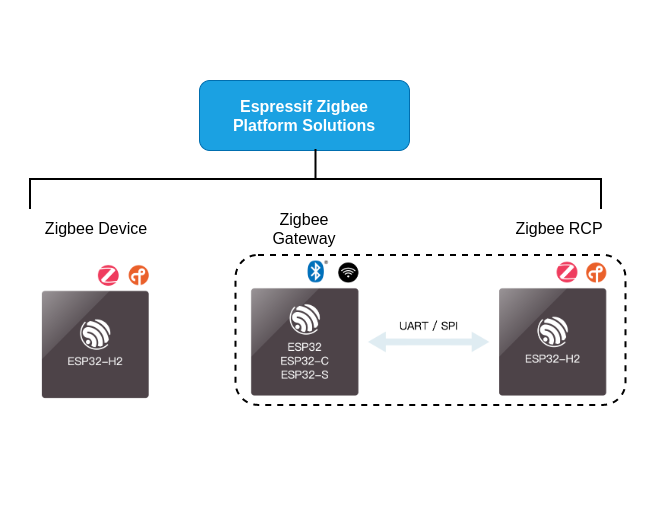
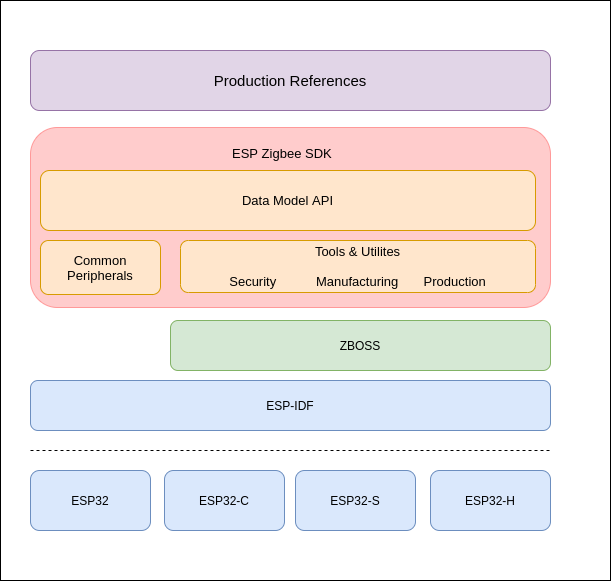

1. Introduction
===============

1.1 Espressif Zigbee Solutions
------------------------------

Espressif's Zigbee Solutions consist of:

   - A full spectrum of Zigbee device platforms
   - Production ready SDK
   - Zigbee and ESP RainMaker integration

1.1.1 Espressif Zigbee Platforms
~~~~~~~~~~~~~~~~~~~~~~~~~~~~~~~~

Espressif platform solutions are as shown below:

- 802.15.4 SoCs (ESP32-H2, ESP32-C6, etc) can be used to build **Zigbee devices**.
- By efficiently combining Espressif 802.15.4 and Wi-Fi SoCs (ESP32, ESP32-C3, ESP32-S3, etc), **Zigbee gateway** can be built to connect the Zigbee network with the Wi-Fi network.
- We also provide Matter-Zigbee bridge solution that enable non-Matter devices based on Zigbee and other protocols to connect to the Matter ecosystem. See `ESP Matter <https://docs.espressif.com/projects/esp-matter/>`__.

1.1.2 ESP Zigbee SDK
~~~~~~~~~~~~~~~~~~~~

Espressif's Zigbee SDK is built on top of the `ESP-IDF <https://github.com/espressif/esp-idf>`__ and `Zboss stack <https://dsr-zboss.com/>`__.

The ZBOSS and Espressif Zigbee SDK is provided as pre-built library:

- `esp-zboss-lib <https://components.espressif.com/components/espressif/esp-zboss-lib>`__: ZBOSS libraries for ESP32 series SoCs

- `esp-zigbee-lib <https://components.espressif.com/components/espressif/esp-zigbee-lib>`__: Espressif Zigbee SDK and APIs libraries

These two library components are hosted by `ESP Registry <https://components.espressif.com/>`__.

1.1.3 Zigbee and ESP RainMaker Integration
~~~~~~~~~~~~~~~~~~~~~~~~~~~~~~~~~~~~~~~~~~

Espressif's AIoT cloud platform `ESP RainMaker <https://rainmaker.espressif.com/>`__ can provide remote control and enable cloud-based device management for Zigbee devices.

By combining the above-mentioned Zigbee hardware and software solutions with ESP RainMaker, this one-stop Zigbee ecosystem solution provides a full-fledged cloud deployment through your own private account with advanced device management features.

.. todo::
    Add introduction here and add example in the rainmaker repository for Zigbee solution

1.2 Supported Features
----------------------

The supported features in current ESP Zigbee SDK are listed below:

- Zigbee 3.0
- Zigbee Pro R22
- Zigbee Cluster Library (ZCL) v8
- Home Automation Devices
- Touchlink
- Green Power Proxy, Sink, GPD
- Coordinator / Router / ZED / Sleepy device roles
- Gateway and Radio Co-Processor (RCP) example
- Network Co-Processor (NCP) and Host example
- Sniffer

1.2.1 ZCL Clusters
~~~~~~~~~~~~~~~~~~

.. table:: **ZCL cluster**
   :align: center

   =========================== ============ 
          Cluster Name          Cluster ID  
   =========================== ============ 
            basic                 0x0000    
      power_configuration         0x0001
           identify               0x0003    
            groups                0x0004    
            scenes                0x0005    
            on_off                0x0006    
       on_off_switch_cfg          0x0007    
         level_control            0x0008    
             time                 0x000a
         analog_input             0x000c
         analog_output            0x000d
         analog_value             0x000e
         binary_input             0x000f
       multistate_value           0x0014
        commissioning             0x0015
              ota                 0x0019
         green_power              0x0021    
         shade_config             0x0100    
           door_lock              0x0101
        window_covering           0x0102
          thermostat              0x0201
          fan_control             0x0202
    thermostat_user_interface     0x0204
         color_control            0x0300
    illuminance_measurement       0x0400   
    temperature_measurement       0x0402
      pressure_measurement        0x0403
        flow_measurement          0x0404
      humidity_measurement        0x0405
       occupancy_sensing          0x0406
    carbon_dioxide_measurement    0x040d
       PM2.5_measurement          0x042a
           ias_zone               0x0500
            price                 0x0700
           metering               0x0702
     meter_identification         0x0b01
    electrical_measurement        0x0b04
          diagnostics             0x0b05
    touchlink_commissioning       0x1000
   =========================== ============ 

1.2.1.1 Attributes and Commands
^^^^^^^^^^^^^^^^^^^^^^^^^^^^^^^

See each cluster's supported attribute in `ZCL api-reference <https://docs.espressif.com/projects/esp-zigbee-sdk/en/latest/esp32/api-reference/zcl/index.html>`__

1.2.2 HA Automation Device Types
~~~~~~~~~~~~~~~~~~~~~~~~~~~~~~~~

.. table:: **Zigbee Home Automation**
   :align: center

   =========== ======================= ======================================================================= 
    Device ID       Device Name                                   Default Clusters                             
   =========== ======================= ======================================================================= 
     0x0002         on_off_light                       basic, identify, groups, scenes, on_off                 
     0x0000         on_off_switch                                 basic, identify                              
     0x0102     color_dimmable_light    basic, identify, groups, scenes, on_off, level_control, color_control  
     0x0105     color_dimmable_switch                              basic, identify                             
     0x0009         power_outlet                       basic, identify, groups,scenes, on_off                  
     0x0200             shade               basic, identify, groups, scenes, on_off, level_control, shade      
     0x0201       shade_controller                                 basic, identify                             
     0x000A           door_lock                      basic, identify, groups, scenes, door_lock                
     0x000B     door_lock_controller                               basic, identify                             
     0x0301         thermostat                         basic, identify, thermostat_configuration
     0x0302      temperature_sensor                       basic, identify, temperature_meas                    
     0x0005      configuration_tool     basic, identify, groups, scenes, on_off, level_control, color_control  
   =========== ======================= ======================================================================= 

See default mandatory attributes in each HA device's cluster in `HA api-reference <https://docs.espressif.com/projects/esp-zigbee-sdk/en/latest/esp32/api-reference/ha/index.html>`__

1.2.3 More Supported
~~~~~~~~~~~~~~~~~~~~

For any new cluster or device needs, please open an `issue <https://github.com/espressif/esp-zigbee-sdk/issues>`__ on GitHub. We will get back to you soon.
