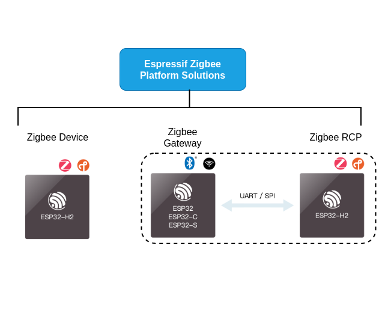

Introduction
============

Espressif Zigbee Solutions
--------------------------

Espressif's Zigbee Solutions consist of:

   - A full spectrum of Zigbee device platforms
   - Production ready SDK
   - Zigbee and ESP RainMaker integration

Espressif Zigbee Platforms
~~~~~~~~~~~~~~~~~~~~~~~~~~

Espressif platform solutions are as shown below:

- 802.15.4 SoCs (ESP32-H2, ESP32-C6, etc) can be used to build **Zigbee devices**.
- By efficiently combining Espressif 802.15.4 and Wi-Fi SoCs (ESP32, ESP32-C3, ESP32-S3, etc), **Zigbee gateway** can be built to connect the Zigbee network with the Wi-Fi network.
- We also provide a Matter-Zigbee bridge solution that enables non-Matter devices based on Zigbee and other protocols to connect to the Matter ecosystem. See `ESP Matter <https://docs.espressif.com/projects/esp-matter/>`__.

ESP Zigbee SDK
~~~~~~~~~~~~~~

Espressif's Zigbee SDK v2.x is built on top of the `ESP-IDF`_ and an Espressif proprietary implementation of Zigbee protocol.
The full SDK is maintained in the `esp-zigbee-sdk`_ repository with several ESP-IDF components, documentations and examples for development.
The core component (`esp-zigbee-lib`_) which is delivered as a pre-built library is also available on `ESP Registry`_.

.. figure:: ../_static/esp_zigbee_sdk.svg
    :align: center
    :alt: ESP Zigbee Software Components
    :figclass: align-center

.. _ESP-IDF: https://github.com/espressif/esp-idf
.. _esp-zigbee-sdk: https://github.com/espressif/esp-zigbee-sdk/tree/main
.. _esp-zigbee-lib: https://components.espressif.com/components/espressif/esp-zigbee-lib
.. _ESP Registry: https://components.espressif.com/

Zigbee and ESP RainMaker Integration
~~~~~~~~~~~~~~~~~~~~~~~~~~~~~~~~~~~~

Espressif's AIoT cloud platform `ESP RainMaker <https://rainmaker.espressif.com/>`__ can provide remote control and enable cloud-based device management for Zigbee devices.

By combining the above-mentioned Zigbee hardware and software solutions with ESP RainMaker, this one-stop Zigbee ecosystem solution provides a full-fledged cloud deployment through your own private account with advanced device management features.

.. todo::
    Add introduction here and add example in the rainmaker repository for Zigbee solution

Supported Features
------------------

The supported features in the current ESP Zigbee SDK are listed below:

- Zigbee 3.0
- Zigbee Pro R23
- Zigbee Cluster Library (ZCL) v8
- Home Automation Devices
- Touchlink
- Coordinator / Router / (Sleepy) End Device roles
- Gateway and Radio Co-Processor (RCP) example
- Command Line Interface (CLI) example

ZCL Clusters
~~~~~~~~~~~~

The following clusters are supported:

.. table:: **Supported ZCL clusters**
   :align: center

   =====================================  ============
               Cluster Name                Cluster ID
   =====================================  ============
     basic                                  0x0000
     power_configuration                    0x0001
     device_temp_config                     0x0002
     identify                               0x0003
     groups                                 0x0004
     scenes                                 0x0005
     on_off                                 0x0006
     on_off_switch_cfg                      0x0007
     level_control                          0x0008
     alarms                                 0x0009
     time                                   0x000a
     analog_input                           0x000c
     analog_output                          0x000d
     analog_value                           0x000e
     binary_input                           0x000f
     binary_output                          0x0010
     binary_value                           0x0011
     multistate_input                       0x0012
     multistate_output                      0x0013
     multistate_value                       0x0014
     commissioning                          0x0015
     ota                                    0x0019
     poll_control                           0x0020
     green_power                            0x0021
     shade_config                           0x0100
     door_lock                              0x0101
     window_covering                        0x0102
     thermostat                             0x0201
     fan_control                            0x0202
     dehumidification_control               0x0203
     thermostat_user_interface              0x0204
     color_control                          0x0300
     illuminance_measurement                0x0400
     temperature_measurement                0x0402
     pressure_measurement                   0x0403
     flow_measurement                       0x0404
     humidity_measurement                   0x0405
     occupancy_sensing                      0x0406
     pH_measurement                         0x0409
     electrical_conductivity_measurement    0x040a
     wind_speed_measurement                 0x040b
     carbon_dioxide_measurement             0x040d
     PM2.5_measurement                      0x042a
     ias_zone                               0x0500
     ias_ace                                0x0501
     ias_wd                                 0x0502
     price                                  0x0700
     metering                               0x0702
     meter_identification                   0x0b01
     electrical_measurement                 0x0b04
     touchlink_commissioning                0x1000
   =====================================  ============

Attributes and Commands
^^^^^^^^^^^^^^^^^^^^^^^

See each cluster's supported attributes in :doc:`ZCL API Reference </api-reference/esp_zigbee_core/zcl/index>`

Home Automation Device Types
~~~~~~~~~~~~~~~~~~~~~~~~~~~~

.. table:: **Zigbee Home Automation** [1]_
   :align: center

   =========== ============================== =========================================================================
    Device ID       Device Name                                           Default Clusters
   =========== ============================== =========================================================================
     0x0000      on_off_switch                  basic, identify, identify*, on_off*
     0x0005      configuration_tool             basic, identify, basic*
     0x0009      mains power_outlet             basic, identify, groups, scenes, on_off
     0x000A      door_lock                      basic, identify, groups, scenes, door_lock
     0x000B      door_lock_controller           basic, identify, identify*, groups*, scenes*, door_lock*
     0x0100      on_off_light                   basic, identify, groups, scenes, on_off
     0x0101      dimmable_light                 basic, identify, groups, scenes, on_off, level_control
     0x0102      color_dimmable_light           basic, identify, groups, scenes, on_off, level_control, color_control
     0x0104      dimmer_switch                  basic, identify, identify*, on_off*, level_control*
     0x0105      color_dimmer_switch            basic, identify, identify*, on_off*, level_control*, color_control*
     0x0106      light_sensor                   basic, identify, illuminance_measurement, identify*
     0x0200      shade                          basic, identify, groups, scenes, on_off, level_control, shade_config
     0x0201      shade_controller               basic, identify, identify*, on_off*, level_control*
     0x0202      window_covering                basic, identify, groups, scenes, window_covering
     0x0203      window_covering_controller     basic, identify, identify*, window_covering*
     0x0301      thermostat                     basic, identify, thermostat
     0x0302      temperature_sensor             basic, identify, temperature_measurement, identify*
   =========== ============================== =========================================================================

.. [1] \* denotes the client cluster.

See default mandatory attributes in each HA device's cluster in :doc:`HA api-reference </api-reference/esp_zigbee_core/ha>`.

More Supported
~~~~~~~~~~~~~~

For any new cluster or device needs, please open an `issue <https://github.com/espressif/esp-zigbee-sdk/issues>`__ on GitHub. We will get back to you soon.
