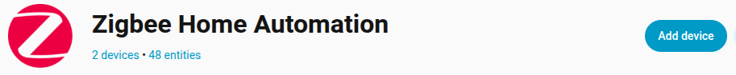
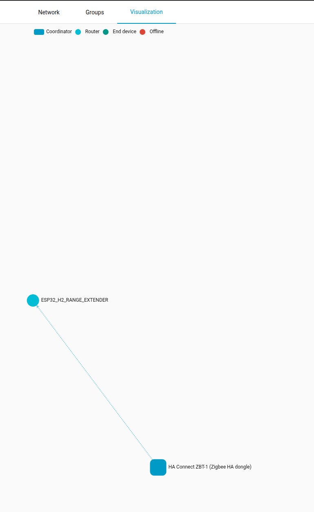
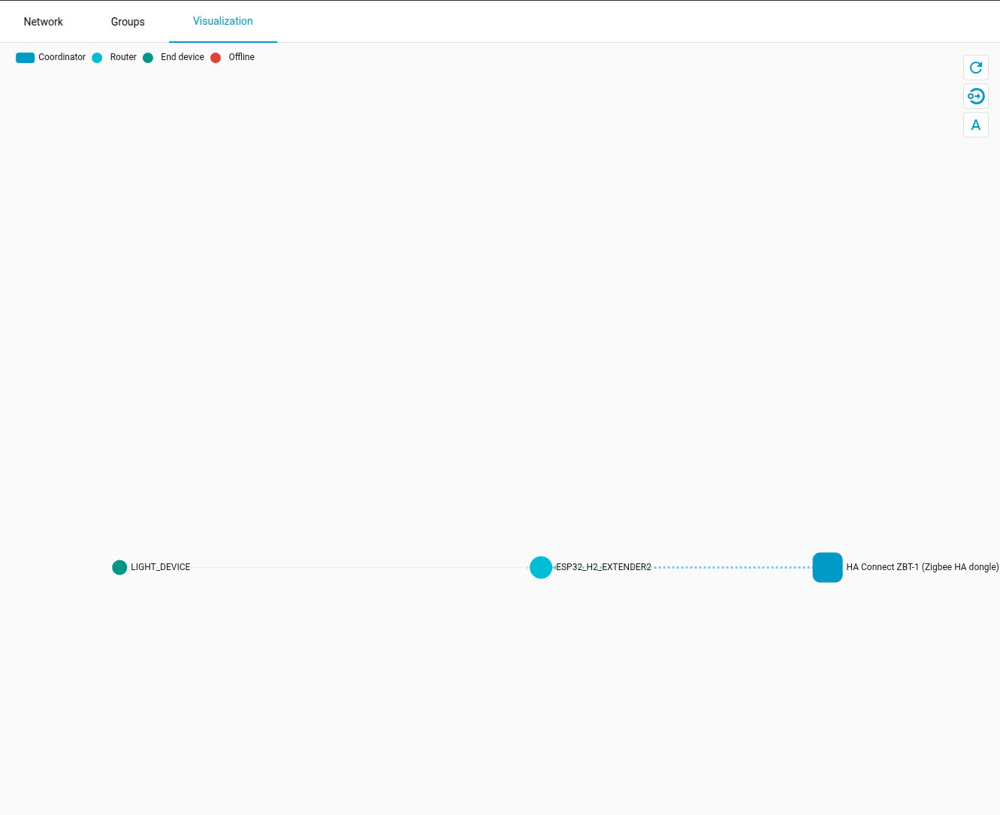

| Supported Targets | ESP32-H2 | ESP32-C6 | ESP32-C5 |
| ----------------- | -------- | -------- | -------- |

# Range Extender Example 

This example demonstrates how to configure a Zigbee Range Extender device without any extra functionality.

## Hardware Required

* One 802.15.4 enabled development board (e.g., ESP32-H2, ESP32-C6 or ESP32-C5).

## Configure the project

Set the correct build target `idf.py set-target TARGET` command. If ie. building for ESP32 H2, command would be idf.py set-target esp32-h2.

## Erase the NVRAM 

Erase any previous configurations and partition schemes by running `idf.py -p PORT erase-flash`. If only one device is connected, -p PORT might be omitted.

## Build and Flash

Build flash and monitor to view the serial output by running `idf.py -p PORT build flash monitor`. If only one device is connected, -p PORT might be omitted.

(To exit the serial monitor, type ``Ctrl-]``. On a different keyboard layout, it might be ie. ``Ctrl+AltGr+G``).

## Application Functions

- When the program starts, this router device will join already existing Zigbee network (make sure Coordinator is accepting new devices to join the network in HA).

```
I (233) main_task: Calling app_main()
I (255) phy: phy_version: 323,2, a8ef10c, Aug  1 2025, 17:46:10
I (257) phy: libbtbb version: 4515421, Aug  1 2025, 17:46:22
I (260) main_task: Returned from app_main()
I (307) ESP32_RANGE_EXTENDER: ZDO signal: ZDO Config Ready (0x17), status: ESP_FAIL
I (308) ESP32_RANGE_EXTENDER: Zigbee stack initialized
I (312) ESP32_RANGE_EXTENDER: Device started up in  factory-reset mode
I (312) ESP32_RANGE_EXTENDER: Start Network Steering
I (3125) ESP32_RANGE_EXTENDER: ZDO signal: NWK Permit Join (0x36), status: ESP_OK
I (3301) ESP32_RANGE_EXTENDER: ZDO signal: NWK Permit Join (0x36), status: ESP_OK
I (3303) ESP32_RANGE_EXTENDER: Joined network successfully
```

- Checkout HA Zigbee network if the device is successfully recognized and should be categorized as a router.


- Try to connect another device that would otherwise not be able to connect to the network (ie. too far). This extender should pick it up and serve as its parent node.
- NOTE: Do not be discouraged if the HA network visualisation does not show the end device being connected to anything, important are the logs on our extender device that we have received a new child node.
```  
I (18679) ESP32_RANGE_EXTENDER: ZDO signal: ZDO Device Update (0x30), status: ESP_OK
I (18695) ESP32_RANGE_EXTENDER: ZDO signal: ZDO Device Announce (0x2), status: ESP_OK
I (29273) ESP32_RANGE_EXTENDER: ZDO signal: NLME Status Indication (0x32), status: ESP_OK
```



## Troubleshooting

Open an [issue](https://github.com/espressif/esp-zigbee-sdk/issues) on GitHub.
