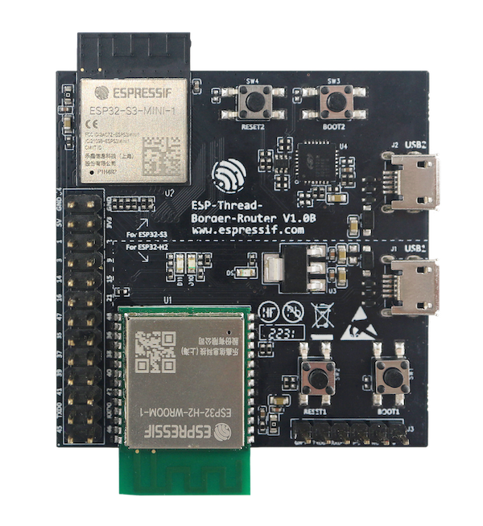

| Supported Targets | ESP32 | ESP32-C3 | ESP32-C6 | ESP32-S2 | ESP32-S3 |
| ----------------- | ----- | -------- | -------- | -------- | -------- |

# Gateway Example

This example demonstrates how to build a Zigbee Gateway device. It runs on a Wi-Fi SoC such as ESP32, ESP32-C3 and ESP32-S3, with an 802.15.4 SoC like ESP32-H2 running [ot_rcp](https://github.com/espressif/esp-idf/tree/master/examples/openthread/ot_rcp) to provide 802.15.4 radio.

## Hardware Platforms

### Wi-Fi based ESP Zigbee Gateway

The Wi-Fi based ESP Zigbee Gateway consists of two SoCs:

* An ESP32 series Wi-Fi SoC (ESP32, ESP32-C, ESP32-S, etc) loaded with ESP Zigbbe Gateway and Zigbee Stack.
* An ESP32-H 802.15.4 SoC loaded with OpenThread RCP.

#### ESP Zigbee Gateway Board

The ESP Zigbee gateway board provides an integrated module of an ESP32-S3 SoC and an ESP32-H2 RCP.



The two SoCs are connected with following interfaces:
* UART for serial communication
* RESET and BOOT pins for RCP Update
* 3-Wires PTA for RF coexistence

No jumper wires needed. No `idf.py menuconfig` under menu "ESP Zigbee gateway rcp update" configure to change.

#### Standalone Modules

The SDK also supports manually connecting an ESP32-H2 RCP to an ESP32 series Wi-Fi SoC. As one way of connection is following:

ESP32 pin     | ESP32-H2 pin
------------- |-------------
   GND        |    G
   GPIO4 (RX) |    TX
   GPIO5 (TX) |    RX
   GPI017     |    RST
   GPIO18     |    GPIO9(BOOT)

TX, RX, RST and BOOT pin from ESP32 side can be configured by user in `idf.py menuconfig` under menu "ESP Zigbee gateway rcp update".

TX, RX pins from ESP32-H2 should be configured in [ot_rcp example](https://github.com/espressif/esp-idf/tree/master/examples/openthread/ot_rcp) via "OpenThread RCP Example > Configure RCP UART pin manually" options.

Other pin number is also available for user to configure if needed.

The following image shows an example connection between ESP32 DevKitC and ESP32-H2 DevKitC:


## Configure the project

Notes:
- Please use the esp-idf master branch ([Commit ad3e1e3](https://github.com/espressif/esp-idf/commit/ad3e1e3daf7037e58c650c735e1f6218ee886651) or later).

Before project configuration and build, make sure to set the correct chip target using `idf.py set-target` command.

## Erase the NVRAM 

Before flash it to the board, it is recommended to erase NVRAM if user doesn't want to keep the previous examples or other projects stored info 
using `idf.py -p PORT erase-flash`

## Create the RCP firmware image

The esp_zigbee_gateway supports updating the RCP image. Generate rcp image before building the esp_zigbee_gateway example.

Build the [ot_rcp](https://github.com/espressif/esp-idf/tree/master/examples/openthread/ot_rcp) example. Later in the esp_zigbee_gateway building process, the built RCP image will be automatically packed into the esp_zigbee_gateway firmware. See detail in [CMakeLists.txt](main/CMakeLists.txt).

Notes:
- `OPENTHREAD_NCP_VENDOR_HOOK` of `ot_rcp` should be selected via menuconfig.

## Build and Flash

Build the project, flash it to the board, and start the monitor tool to view the serial output by running `idf.py -p PORT flash monitor`

(To exit the serial monitor, type ``Ctrl-]``.)

## Example Output

As you run the example, you will see the following log:

```
I (550) RCP_UPDATE: RCP: using update sequence 0
I (550) ESP_RADIO_SPINEL: spinel UART interface initialization completed
I (550) ESP_RADIO_SPINEL: Spinel UART interface has been successfully enabled
I (560) ZB_ESP_SPINEL: Spinel UART interface enable successfully
I (570) main_task: Returned from app_main()
I(570) OPENTHREAD:[I] P-RadioSpinel-: RCP reset: RESET_POWER_ON
I(580) OPENTHREAD:[I] P-RadioSpinel-: Software reset RCP successfully
I (610) ZB_ESP_SPINEL: Radio spinel workflow register successfully
I (610) ESP_ZB_GATEWAY: Running RCP Version: openthread-esp32/ad3e1e3daf-41ef80717; esp32h2;  2024-02-04 06:16:56 UTC
I (620) ESP_ZB_GATEWAY: Storage RCP Version: openthread-esp32/ad3e1e3daf-41ef80717; esp32h2;  2024-02-04 06:16:56 UTC
I (630) ESP_ZB_GATEWAY: *** MATCH VERSION! ***
I (800) ESP_ZB_GATEWAY: ZDO signal: ZDO Config Ready (0x17), status: ESP_FAIL
I (800) example_connect: Start example_connect.
I (800) pp: pp rom version: e7ae62f
I (810) net80211: net80211 rom version: e7ae62f
I (820) wifi:wifi driver task: 3fcaca8c, prio:23, stack:6656, core=0
I (820) wifi:wifi firmware version: 3865d68
I (820) wifi:wifi certification version: v7.0
I (820) wifi:config NVS flash: enabled
I (830) wifi:config nano formating: disabled
I (830) wifi:Init data frame dynamic rx buffer num: 32
I (840) wifi:Init static rx mgmt buffer num: 5
I (840) wifi:Init management short buffer num: 32
I (850) wifi:Init dynamic tx buffer num: 32
I (850) wifi:Init static tx FG buffer num: 2
I (850) wifi:Init static rx buffer size: 1600
I (860) wifi:Init static rx buffer num: 10
I (860) wifi:Init dynamic rx buffer num: 32
I (870) wifi_init: rx ba win: 6
I (870) wifi_init: accept mbox: 6
I (870) wifi_init: tcpip mbox: 32
I (880) wifi_init: udp mbox: 6
I (880) wifi_init: tcp mbox: 6
I (880) wifi_init: tcp tx win: 5760
I (890) wifi_init: tcp rx win: 5760
I (890) wifi_init: tcp mss: 1440
I (900) wifi_init: WiFi IRAM OP enabled
I (900) wifi_init: WiFi RX IRAM OP enabled
I (910) phy_init: phy_version 620,ec7ec30,Sep  5 2023,13:49:13
W (910) phy_init: failed to load RF calibration data (0x1102), falling back to full calibration
I (980) wifi:mode : sta (34:85:18:7e:7c:9c)
I (990) wifi:enable tsf
I (990) example_connect: Connecting to myssid...
I (990) example_connect: Waiting for IP(s)
I (3400) wifi:new:<6,0>, old:<1,0>, ap:<255,255>, sta:<6,0>, prof:1
I (3690) wifi:state: init -> auth (b0)
I (3690) wifi:state: auth -> assoc (0)
I (3700) wifi:state: assoc -> run (10)
I (3730) wifi:connected with myssid, aid = 1, channel 6, BW20, bssid = 02:0f:c1:32:3b:2b
I (3730) wifi:security: WPA2-PSK, phy: bgn, rssi: -25
I (3730) wifi:pm start, type: 1

I (3730) wifi:dp: 1, bi: 102400, li: 3, scale listen interval from 307200 us to 307200 us
I (3740) wifi:set rx beacon pti, rx_bcn_pti: 0, bcn_timeout: 25000, mt_pti: 0, mt_time: 10000
I (3750) wifi:AP's beacon interval = 102400 us, DTIM period = 1
I (3890) wifi:<ba-add>idx:0 (ifx:0, 02:0f:c1:32:3b:2b), tid:0, ssn:0, winSize:64
I (4760) esp_netif_handlers: example_netif_sta ip: 192.168.1.103, mask: 255.255.255.0, gw: 192.168.1.1
I (4760) example_connect: Got IPv4 event: Interface "example_netif_sta" address: 192.168.1.103
I (5490) example_connect: Got IPv6 event: Interface "example_netif_sta" address: fe80:0000:0000:0000:3685:18ff:fe7e:7c9c, type: ESP_IP6_ADDR_IS_LINK_LOCAL
I (5490) example_common: Connected to example_netif_sta
I (5500) example_common: - IPv4 address: 192.168.1.103,
I (5500) example_common: - IPv6 address: fe80:0000:0000:0000:3685:18ff:fe7e:7c9c, type: ESP_IP6_ADDR_IS_LINK_LOCAL
I (5510) wifi:Set ps type: 0, coexist: 0

I (5520) ESP_ZB_GATEWAY: Zigbee stack initialized
I (5530) ESP_ZB_GATEWAY: Device started up in  factory-reset mode
I (5530) ESP_ZB_GATEWAY: Start network formation
W (5700) ESP_ZB_GATEWAY: Network(0x79f0) closed, devices joining not allowed.
I (5700) ESP_ZB_GATEWAY: Formed network successfully (Extended PAN ID: 60:55:f9:ff:fe:f7:69:24, PAN ID: 0x79f0, Channel:13, Short Address: 0x0000)
I (6310) ESP_ZB_GATEWAY: Network(0x79f0) is open for 180 seconds
I (6310) ESP_ZB_GATEWAY: Network steering started
```

## Gateway Functions

 * The built esp_zigbee_gateway image will contain an updatable RCP image and can automatically update the RCP on version mismatch or RCP failure.
 * After Zigbee gateway starts up, it will read MAC ieee address and Zigbee stack version string from the ot_rcp and start working together with ot_rcp via UART communication to form a Zigbee network
 * More Gateway functionalities supporting Wi-Fi interaction will come later

## Troubleshooting

For any technical queries, please open an [issue](https://github.com/espressif/esp-zigbee-sdk/issues) on GitHub. We will get back to you soon
