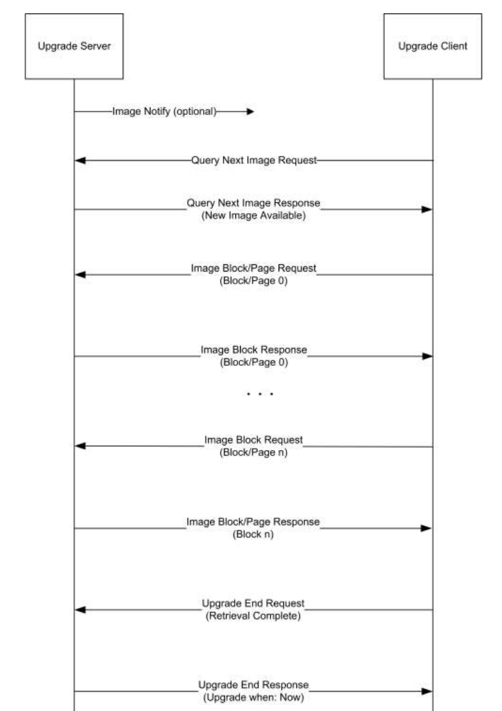

| Supported Targets | ESP32-H2 |
| ----------------- | -------- |

# OTA Upgrade Example 

This example code shows how to add OTA client attribute and parameter, add OTA cluster and add endpoint to a device. It demonstrates the whole OTA process from client side.

## Hardware Required

* One development board with ESP32-H2 SoC acting as Zigbee end device (loaded with ota_client example)
* A USB cable for power supply and programming
* Choose another ESP32-H2 as Zigbee coordinator (loaded with ota_server example), see [ota_server](../ota_server/))

## Configure the project

Before project configuration and build, set the correct chip target using `idf.py --preview set-target esp32h2`.

## Erase the NVRAM 

Before flash it to the board, it is recommended to erase NVRAM if user doesn't want to keep the previous examples or other projects stored info 
using `idf.py -p PORT erase-flash`

## Build and Flash

Build the project, flash it to the board, and start the monitor tool to view the serial output by running `idf.py -p PORT flash monitor`.

(To exit the serial monitor, type ``Ctrl-]``.)

## Example Output

As you run the example, you will see the following log:

```
I (320) spi_flash: detected chip: generic
I (324) spi_flash: flash io: dio
I (328) cpu_start: Starting scheduler.
I (333) ESP_OTA_CLIENT: OTA example 1.0 is running
I (333) system_api: Base MAC address is not set
I (343) system_api: read default base MAC address from EFUSE
I (403) phy: phy_version: 101,1, 7943bb3, Jul 26 2022, 11:31:12
I (883) ESP_OTA_CLIENT: ZDO signal: 23, status: -1
I (3543) ESP_OTA_CLIENT: Start network steering
I (17303) ESP_OTA_CLIENT: Joined network successfully (Extended PAN ID: ff:fc:ca:c0:f0:bd:97:10, PAN ID: 0x47ce)
I (37093) ESP_OTA_CLIENT: OTA upgrade status:0
I (37313) ESP_OTA_CLIENT: OTA upgrade status:2
I (37543) ESP_OTA_CLIENT: OTA upgrade status:2
.
.
I (3014933) ESP_OTA_CLIENT: OTA upgrade status:2
I (3015163) ESP_OTA_CLIENT: OTA upgrade status:2
I (3015163) ESP_OTA_CLIENT: OTA upgrade status:5
I (3015223) ESP_OTA_CLIENT: OTA upgrade status:1
I (3015223) ESP_OTA_CLIENT: OTA upgrade status:3
I (3015223) esp_image: segment 0: paddr=001d0020 vaddr=3c050020 size=09b18h ( 39704) map
I (3015273) esp_image: segment 1: paddr=001d9b40 vaddr=3fc8d0c0 size=01a58h (  6744) 
I (3015283) esp_image: segment 2: paddr=001db5a0 vaddr=40380000 size=04a78h ( 19064) 
I (3015303) esp_image: segment 3: paddr=001e0020 vaddr=42000020 size=4edf4h (323060) map
I (3015663) esp_image: segment 4: paddr=0022ee1c vaddr=40384a78 size=08640h ( 34368) 
I (3015703) esp_image: segment 0: paddr=001d0020 vaddr=3c050020 size=09b18h ( 39704) map
I (3015743) esp_image: segment 1: paddr=001d9b40 vaddr=3fc8d0c0 size=01a58h (  6744) 
I (3015753) esp_image: segment 2: paddr=001db5a0 vaddr=40380000 size=04a78h ( 19064) 
I (3015773) esp_image: segment 3: paddr=001e0020 vaddr=42000020 size=4edf4h (323060) map
I (3016123) esp_image: segment 4: paddr=0022ee1c vaddr=40384a78 size=08640h ( 34368)
I (3016153) ESP_ZIGBEE_CORE: Prepare to restart system
0x403806ce: esp_restart_noos at /home/abudlrehman/esp/esp-idf/components/esp_system/port/soc/esp32h2/system_internal.c:129 (discriminator 1)
I (312) spi_flash: detected chip: generic
I (316) spi_flash: flash io: dio
I (320) cpu_start: Starting scheduler.
I (325) ESP_OTA_CLIENT: OTA example 2.0 is running
I (325) system_api: Base MAC address is not set
I (335) system_api: read default base MAC address from EFUSE
I (385) phy: phy_version: 101,0, 7943bb3, Jul 26 2022, 11:31:12
I (405) ESP_OTA_CLIENT: ZDO signal: 23, status: -1
I (1025) ESP_OTA_CLIENT: Joined network successfully (Extended PAN ID: ff:fc:74:c0:f0:bd:97:10, PAN ID: 0xc9ed)
```

## OTA Upgrade Functions

 * After receiving OTA image notify from server, client send the query image request and image block requests to server upon receiving the response from server.
 * Following diagram explains the OTA upgrade process in detail:
 
 * Server gets the upgrade bin file (ota_file.bin) and transmit it through OTA process. After upgrade finish, the client will restart. Upgrade bin file will be loaded from client side and a log "OTA example 2.0 is running" can be seen on the log indicates OTA file upgraded successfully.

## Troubleshooting

For any technical queries, please open an [issue](https://github.com/espressif/esp-zigbee-sdk/issues) on GitHub. We will get back to you soon.
