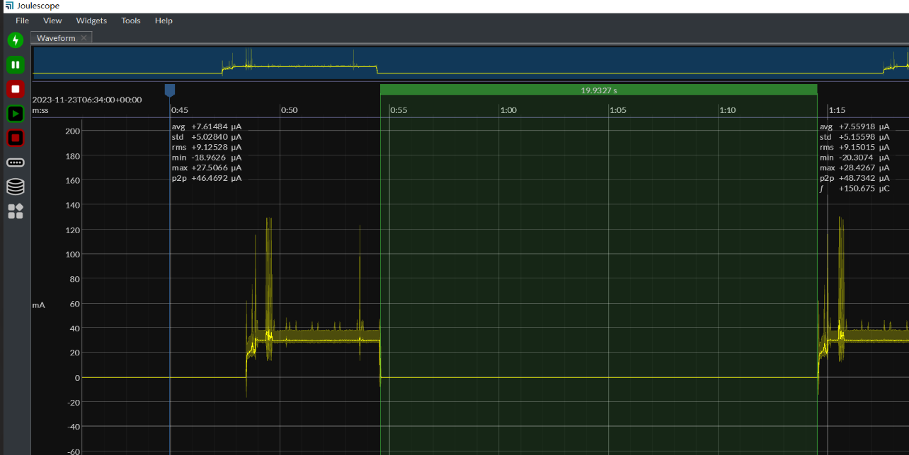

| Supported Targets | ESP32-H2 | ESP32-C6 |
| ----------------- | -------- | -------- |

# Sleepy End Device Example

This test code shows how to configure Zigbee sleepy end device using [Deep Sleep mode](https://docs.espressif.com/projects/esp-idf/en/latest/esp32h2/api-reference/system/sleep_modes.html#sleep-modes).

This example is designed to address a specific deep sleep application scenario. First, it joins to the Zigbee network, and after 5 seconds, it enters deep sleep mode. There are two ways to wake up in this example: one is by using a 20-second periodic RTC timer, and the other is through GPIO input. Deep sleep is part of the upper-layer logic, and it's the user's responsibility to manage it in their own applications. If you need more wake-up methods, you can refer to the [Exapmle deep sleep]([../../../system/deep_sleep/](https://github.com/espressif/esp-idf/tree/master/examples/system/deep_sleep)). Additionally, Espressif provides a stub for handling wake-ups, which allows for a quick check, and the user can decide whether to wake up or continue deep sleep in this stub, as explained in the [Example deep sleep stub]([../../../system/deep_sleep_wake_stub](https://github.com/espressif/esp-idf/tree/master/examples/system/deep_sleep_wake_stub)).

Note: Implementing a standard Zigbee Sleepy Device is recommended using the [Light Sleep example](../light_sleep). Deep sleep triggers a reboot, and the device needs to undergo a re-attach process to rejoin the network. This means additional packet interactions are necessary after each wake-up from deep sleep. It can be advantageous in reducing power consumption, especially when the device remains in a sleep state for extended periods, such as more than 30 minutes.

## Hardware Required

* One development board with ESP32-H2 SoC acting as Zigbee end-device (loaded with sleepy_end_device example)
* A USB cable for power supply and programming
* Choose another ESP32-H2 as Zigbee coordinator (see [HA_on_off_switch example](../../esp_zigbee_HA_sample/HA_on_off_switch/))

## Configure the project

Before project configuration and build, make sure to set the correct chip target using `idf.py set-target TARGET` command.

## Erase the NVRAM

Before flash it to the board, it is recommended to erase NVRAM if user doesn't want to keep the previous examples or other projects stored info
using `idf.py -p PORT erase-flash`

## Build and Flash

Build the project, flash it to the board, and start the monitor tool to view the serial output by running `idf.py -p PORT flash monitor`.

(To exit the serial monitor, type ``Ctrl-]``.)

## Example Output

As you run the example, you will see the following log:

```
I (414) sleep: Configure to isolate all GPIO pins in sleep state
I (420) sleep: Enable automatic switching of GPIO sleep configuration
I (427) main_task: Started on CPU0
I (427) main_task: Calling app_main()
I (437) ESP_ZB_DEEP_SLEEP: Not a deep sleep reset
I (437) ESP_ZB_DEEP_SLEEP: Enabling timer wakeup, 20s

I (447) phy: phy_version: 211,0, 5857fe5, Nov  1 2023, 11:31:09
I (447) phy: libbtbb version: ce629d6, Nov  1 2023, 11:31:19
I (457) main_task: Returned from app_main()
I (587) ESP_ZB_DEEP_SLEEP: ZDO signal: ZDO Config Ready (0x17), status: ESP_FAIL
I (587) ESP_ZB_DEEP_SLEEP: Zigbee stack initialized
I (587) ESP_ZB_DEEP_SLEEP: Start network steering
I (10557) ESP_ZB_DEEP_SLEEP: Joined network successfully (Extended PAN ID: 60:55:f9:ff:fe:f7:2f:3e, PAN ID: 0xe4c4, Channel:13, Short Address: 0x5e1c)
I (10567) ESP_ZB_DEEP_SLEEP: Start one-shot timer for 5s to enter the deep sleep
I (15567) ESP_ZB_DEEP_SLEEP: Enter deep sleep

ESP-ROM:esp32h2-20221101
Build:Nov  1 2022
rst:0x5 (SLEEP_WAKEUP),boot:0xc (SPI_FAST_FLASH_BOOT)
SPIWP:0xee

...
...
...

I (225) sleep: Configure to isolate all GPIO pins in sleep state
I (231) sleep: Enable automatic switching of GPIO sleep configuration
I (239) main_task: Started on CPU0
I (239) main_task: Calling app_main()
I (249) ESP_ZB_DEEP_SLEEP: Wake up from timer. Time spent in deep sleep and boot: 20257ms
I (249) ESP_ZB_DEEP_SLEEP: Enabling timer wakeup, 20s

I (269) phy: phy_version: 211,0, 5857fe5, Nov  1 2023, 11:31:09
I (269) phy: libbtbb version: ce629d6, Nov  1 2023, 11:31:19
I (279) main_task: Returned from app_main()
I (307) ESP_ZB_DEEP_SLEEP: ZDO signal: ZDO Config Ready (0x17), status: ESP_FAIL
I (307) ESP_ZB_DEEP_SLEEP: Zigbee stack initialized
I (587) ESP_ZB_DEEP_SLEEP: Device started up in non factory-reset mode
I (587) ESP_ZB_DEEP_SLEEP: Device rebooted
I (587) ESP_ZB_DEEP_SLEEP: Start one-shot timer for 5s to enter the deep sleep
I (5597) ESP_ZB_DEEP_SLEEP: Enter deep sleep
```

During the deep sleep, a typical power consumption is shown below:


## Troubleshooting

For any technical queries, please open an [issue](https://github.com/espressif/esp-zigbee-sdk/issues) on GitHub. We will get back to you soon.
