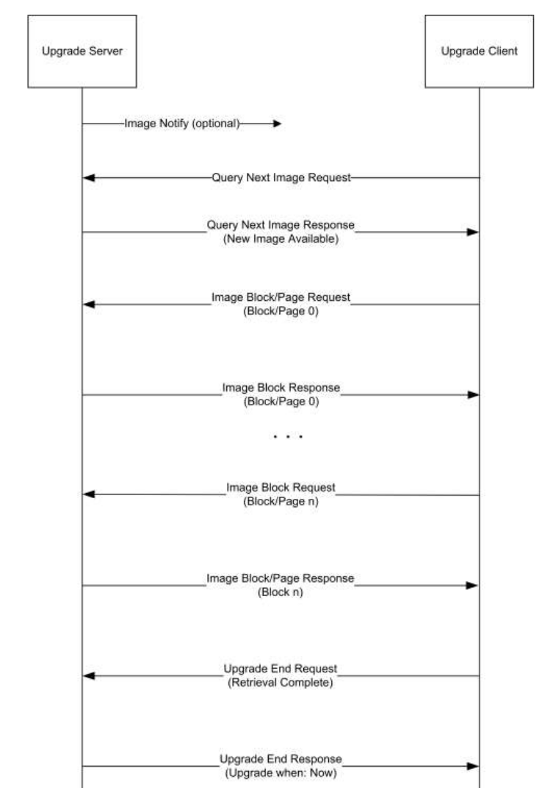

| Supported Targets | ESP32-H2 | ESP32-C6 | ESP32-C5 |
| ----------------- | -------- | -------- | -------- |

# OTA Upgrade Example 

This example demonstrates how to perform an OTA process from Zigbee OTA upgrade server side.

## Hardware Required

* One 802.15.4 enabled development board (e.g., ESP32-H2 or ESP32-C6) running this example.
* A second board running as a Zigbee end device (see [ota_client](../ota_client/) example)

## Configure the project

Before project configuration and build, set the correct chip target using `idf.py set-target TARGET` command.

## Erase the NVRAM 

Before flash it to the board, it is recommended to erase NVRAM if user doesn't want to keep the previous examples or other projects stored info 
using `idf.py -p PORT erase-flash`

## Build and Flash

Build the project, flash it to the board, and start the monitor tool to view the serial output by running `idf.py -p PORT flash monitor`.

(To exit the serial monitor, type ``Ctrl-]``.)

## Application Function

- When the program starts, the board, acting as the Zigbee Coordinator with the `OTA Upgrade Server` function and forms an open Zigbee network within 180 seconds.
```
I (451) main_task: Calling app_main()
I (461) OTA_SERVER: Start ESP Zigbee Stack
I (471) esp zigbee sleep: light sleap disabled
I (481) phy: phy_version: 323,2, a8ef10c, Aug  1 2025, 17:46:10
I (481) phy: libbtbb version: 4515421, Aug  1 2025, 17:46:22
I (501) OTA_SERVER: Initialize Zigbee stack
I (501) OTA_SERVER: Deferred driver initialization successful
I (501) OTA_SERVER: Device started up in factory-reset mode
I (511) main_task: Returned from app_main()
I (821) OTA_SERVER: Formed network successfully: PAN ID(0x1c08, EXT: 0x4831b7fffec18405), Channel(13), Short Address(0x0000)
I (1241) OTA_SERVER: Network steering completed
```

- If a device joins the network created by the board, an `Image Notify` request will be broadcasted to the network.
```
I (17571) OTA_SERVER: New device commissioned or rejoined (short: 0xa8d6)
I (17571) OTA_SERVER: Broadcast OTA Image Notify Command
```

- If a `Query Next Image` request is received by the board, the OTA upgrade process will begin, provided that the OTA version matches.
```
I (976) OTA_SERVER: Network steering completed
I (2076) OTA_SERVER: Zigbee APP Signal: ZDO Device Update(type: 0x07)
I (2116) OTA_SERVER: New device commissioned or rejoined (short: 0x91ab)
I (2116) OTA_SERVER: Broadcast OTA Image Notify Command
I (2206) OTA_SERVER: -- OTA Upgrade Server Progress
I (2206) OTA_SERVER: OTA Query Start:
I (2206) OTA_SERVER:   Client: short_addr=0x91ab, ep_id=10
I (2206) OTA_SERVER:   Query: manuf_code=0x131b, image_type=0x0001, file_version=0xffffffff, hw_version=0x0000
I (2216) OTA_SERVER:   Policy: file_version=0x10022000
I (2756) OTA_SERVER: Zigbee APP Signal: ZDO Device Authorized(type: 0x08)
I (2786) OTA_SERVER: -- OTA Upgrade Server Progress
I (2786) OTA_SERVER: OTA Sending Block:
I (2786) OTA_SERVER:   manuf_code=0x131b, image_type=0x0001, file_version=0x10022000
W (2786) OTA_SERVER: In progress: [0 / 501134]
I (2806) OTA_SERVER: Network(0x726f) is open for 180 seconds
I (2946) OTA_SERVER: -- OTA Upgrade Server Progress
I (2956) OTA_SERVER: OTA Sending Block:
I (2956) OTA_SERVER:   manuf_code=0x131b, image_type=0x0001, file_version=0x10022000
W (2956) OTA_SERVER: In progress: [223 / 501134]
I (3096) OTA_SERVER: -- OTA Upgrade Server Progress
I (3106) OTA_SERVER: OTA Sending Block:
I (3106) OTA_SERVER:   manuf_code=0x131b, image_type=0x0001, file_version=0x10022000
W (3106) OTA_SERVER: In progress: [446 / 501134]
I (3236) OTA_SERVER: -- OTA Upgrade Server Progress
I (3246) OTA_SERVER: OTA Sending Block:
I (3246) OTA_SERVER:   manuf_code=0x131b, image_type=0x0001, file_version=0x10022000
W (3246) OTA_SERVER: In progress: [669 / 501134]
I (3376) OTA_SERVER: -- OTA Upgrade Server Progress
I (3386) OTA_SERVER: OTA Sending Block:
I (3386) OTA_SERVER:   manuf_code=0x131b, image_type=0x0001, file_version=0x10022000
W (3386) OTA_SERVER: In progress: [892 / 501134]
I (3526) OTA_SERVER: -- OTA Upgrade Server Progress
I (3536) OTA_SERVER: OTA Sending Block:
I (3536) OTA_SERVER:   manuf_code=0x131b, image_type=0x0001, file_version=0x10022000
W (3536) OTA_SERVER: In progress: [1115 / 501134]
I (3666) OTA_SERVER: -- OTA Upgrade Server Progress
I (3676) OTA_SERVER: OTA Sending Block:
I (3676) OTA_SERVER:   manuf_code=0x131b, image_type=0x0001, file_version=0x10022000
W (3676) OTA_SERVER: In progress: [1338 / 501134]
```

- After the OTA upgrade is completed, the board will finalize the OTA process.
```
I (336206) OTA_SERVER: OTA Sending Block:
I (336206) OTA_SERVER:   manuf_code=0x131b, image_type=0x0001, file_version=0x10022000
W (336216) OTA_SERVER: In progress: [499520 / 501134]
I (336356) OTA_SERVER: -- OTA Upgrade Server Progress
I (336356) OTA_SERVER: OTA Sending Block:
I (336356) OTA_SERVER:   manuf_code=0x131b, image_type=0x0001, file_version=0x10022000
W (336366) OTA_SERVER: In progress: [499743 / 501134]
I (336496) OTA_SERVER: -- OTA Upgrade Server Progress
I (336496) OTA_SERVER: OTA Sending Block:
I (336496) OTA_SERVER:   manuf_code=0x131b, image_type=0x0001, file_version=0x10022000
W (336506) OTA_SERVER: In progress: [499966 / 501134]
I (336636) OTA_SERVER: -- OTA Upgrade Server Progress
I (336636) OTA_SERVER: OTA Sending Block:
I (336636) OTA_SERVER:   manuf_code=0x131b, image_type=0x0001, file_version=0x10022000
W (336646) OTA_SERVER: In progress: [500189 / 501134]
I (336756) OTA_SERVER: -- OTA Upgrade Server Progress
I (336756) OTA_SERVER: OTA Sending Block:
I (336756) OTA_SERVER:   manuf_code=0x131b, image_type=0x0001, file_version=0x10022000
W (336766) OTA_SERVER: In progress: [500412 / 501134]
I (336906) OTA_SERVER: -- OTA Upgrade Server Progress
I (336906) OTA_SERVER: OTA Sending Block:
I (336906) OTA_SERVER:   manuf_code=0x131b, image_type=0x0001, file_version=0x10022000
W (336916) OTA_SERVER: In progress: [500635 / 501134]
I (337076) OTA_SERVER: -- OTA Upgrade Server Progress
I (337076) OTA_SERVER: OTA Sending Block:
I (337076) OTA_SERVER:   manuf_code=0x131b, image_type=0x0001, file_version=0x10022000
W (337086) OTA_SERVER: In progress: [500858 / 501134]
I (337206) OTA_SERVER: -- OTA Upgrade Server Progress
I (337206) OTA_SERVER: OTA Sending Block:
I (337206) OTA_SERVER:   manuf_code=0x131b, image_type=0x0001, file_version=0x10022000
W (337216) OTA_SERVER: In progress: [501081 / 501134]
I (337326) OTA_SERVER: -- OTA Upgrade Server Progress
I (337326) OTA_SERVER: OTA Upgrade End:
I (337326) OTA_SERVER:   status=0x00, manuf_code=0x131b, image_type=0x0001, file_version=0x10022000
```

- This board can initiate an `Image Notify` request again when the `BOOT` button on the board is pressed.

- The [OTA file](main/ota_file.bin) in this example is built using the [image_builder_tool](../../../tools/image_builder_tool/image_builder_tool.py), which generates a standard OTA image format.


## OTA Upgrade Message Diagram 

 

## Troubleshooting

For any technical queries, please open an [issue](https://github.com/espressif/esp-zigbee-sdk/issues) on GitHub. We will get back to you soon.
