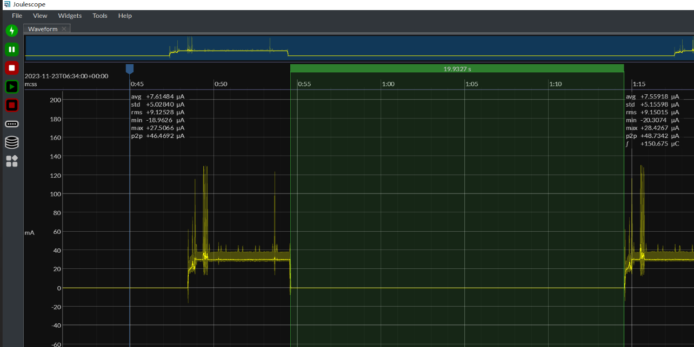

| Supported Targets | ESP32-H2 | ESP32-C6 |
| ----------------- | -------- | -------- |

# Sleepy End Device Example

This example demonstrates how to configure a Zigbee end device in [deep sleep mode](https://docs.espressif.com/projects/esp-idf/en/latest/esp32h2/api-reference/system/sleep_modes.html#id1).

## Hardware Required
* One 802.15.4 enabled development board (e.g., ESP32-H2 or ESP32-C6) running this example.
* A second board running a Zigbee coordinator (see [on_off_light](../../home_automation_devices/on_off_light/) example)

## Configure the project

Before project configuration and build, make sure to set the correct chip target using `idf.py set-target TARGET` command.

## Erase the NVRAM

Before flash it to the board, it is recommended to erase NVRAM if user doesn't want to keep the previous examples or other projects stored info
using `idf.py -p PORT erase-flash`

## Build and Flash

Build the project, flash it to the board, and start the monitor tool to view the serial output by running `idf.py -p PORT flash monitor`.

(To exit the serial monitor, type ``Ctrl-]``.)

## Application Functions

- When the program starts, the board will attempt to detect an available Zigbee network.
```
I (427) main_task: Calling app_main()
I (447) DEEP_SLEEP_END_DEVICE: Wake up from unknown cause, deep sleep for 138 milliseconds
I (447) DEEP_SLEEP_END_DEVICE: Enter deep sleep 5 seconds
I (447) DEEP_SLEEP_END_DEVICE: Start ESP Zigbee Stack
I (457) esp zigbee sleep: light sleap disabled
I (467) phy: phy_version: 323,2, a8ef10c, Aug  1 2025, 17:46:10
I (467) phy: libbtbb version: 4515421, Aug  1 2025, 17:46:22
I (487) DEEP_SLEEP_END_DEVICE: Initialize Zigbee stack
I (487) DEEP_SLEEP_END_DEVICE: Deferred driver initialization successful
I (487) DEEP_SLEEP_END_DEVICE: Device started up in factory-reset mode
I (497) main_task: Returned from app_main()
I (2777) DEEP_SLEEP_END_DEVICE: Joined network successfully: PAN ID(0x3669, EXT: 0x4831b7fffec18405), Channel(13), Short Address(0x1a4b)
I (2777) DEEP_SLEEP_END_DEVICE: Attempt to find HA light device in the network
I (4757) DEEP_SLEEP_END_DEVICE: Attempt to bind HA light device (short address: 0x0000)
I (4767) DEEP_SLEEP_END_DEVICE: Bound HA light device successfully
I (5447) DEEP_SLEEP_END_DEVICE: Enter deep sleep for 20 seconds
```

- If the board is on a network, it acts as a Zigbee end device with the `Home Automation On/Off Light` function.

- The board will enter deep sleep mode when Zigbee task is idle. The board can be woken up by a GPIO interrupt or a RTC timer timeout.

- When the board wakes up from deep sleep mode, it will trigger a reboot.
```
ESP-ROM:esp32h2-20221101
Build:Nov  1 2022
rst:0x5 (SLEEP_WAKEUP),boot:0xc (SPI_FAST_FLASH_BOOT)
SPIWP:0xee
...
...
...

I (212) sleep_gpio: Configure to isolate all GPIO pins in sleep state
I (218) sleep_gpio: Enable automatic switching of GPIO sleep configuration
I (227) main_task: Started on CPU0
I (237) main_task: Calling app_main()
I (257) DEEP_SLEEP_END_DEVICE: Wake up from timer, deep sleep for 20259 milliseconds
I (257) DEEP_SLEEP_END_DEVICE: Enter deep sleep 5 seconds
I (257) DEEP_SLEEP_END_DEVICE: Start ESP Zigbee Stack
I (267) esp zigbee sleep: light sleap disabled
I (277) phy: phy_version: 323,2, a8ef10c, Aug  1 2025, 17:46:10
I (287) phy: libbtbb version: 4515421, Aug  1 2025, 17:46:22
I (307) DEEP_SLEEP_END_DEVICE: Initialize Zigbee stack
I (307) main_task: Returned from app_main()
I (817) DEEP_SLEEP_END_DEVICE: Deferred driver initialization successful
I (817) DEEP_SLEEP_END_DEVICE: Device started up in non factory-reset mode
I (827) DEEP_SLEEP_END_DEVICE: Device rebooted
I (5257) DEEP_SLEEP_END_DEVICE: Enter deep sleep for 20 seconds
```

- Pressing the `BOOT` button will also wake up the board.

- Deep sleep is not used by the SDK. The developer should manage it in their applications. For more wake-up methods, you can refer to the
  [deep sleep example](https://github.com/espressif/esp-idf/tree/master/examples/system/deep_sleep) of ESP-IDF. Additionally, Espressif provides a
  stub for handling wake-ups, which allows for a quick check, and the user can decide whether to wake up or continue deep sleep in this stub, as
  explained in the [deep sleep stub example](https://github.com/espressif/esp-idf/tree/master/examples/system/deep_sleep_wake_stub) of ESP-IDF.

- Implementing a standard Zigbee Sleepy Device is recommended using the [Light Sleep example](../light_sleep). Deep sleep triggers a reboot, and the device needs
  to undergo a re-attach process to rejoin the network. This means additional packet interactions are required after each wake-up from deep sleep. However, the
  Deep sleep mode can be advantageous in reducing power consumption, especially when the device remains in a sleep state for extended periods, such as more than
  30 minutes.

During the deep sleep, a typical power consumption is shown below:



## Troubleshooting

For any technical queries, please open an [issue](https://github.com/espressif/esp-zigbee-sdk/issues) on GitHub. We will get back to you soon.
