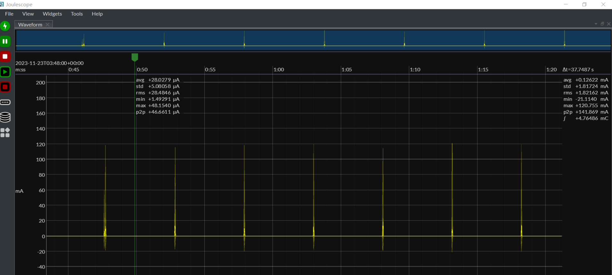

| Supported Targets | ESP32-H2 | ESP32-C6 |
| ----------------- | -------- | -------- |

# Sleepy End Device Example 

This example demonstrates how to configure a Zigbee end device in [light sleep mode](https://docs.espressif.com/projects/esp-idf/en/latest/esp32h2/api-reference/system/sleep_modes.html#id1).

## Hardware Required
* One 802.15.4 enabled development board (e.g., ESP32-H2 or ESP32-C6) running this example.
* A second board running a Zigbee coordinator (see [on_off_light](../../home_automation_devices/on_off_light/) example)

## Configure the project

Before project configuration and build, make sure to set the correct chip target using `idf.py set-target TARGET` command.

## Erase the NVRAM 

Before flash it to the board, it is recommended to erase NVRAM if user doesn't want to keep the previous examples or other projects stored info 
using `idf.py -p PORT erase-flash`

## Build and Flash

Build the project, flash it to the board, and start the monitor tool to view the serial output by running `idf.py -p PORT flash monitor`.

(To exit the serial monitor, type ``Ctrl-]``.)

## Application Functions

- When the program starts, the board will attempt to detect an available Zigbee network.
```
I (444) main_task: Calling app_main()
I (461) pm: Frequency switching config: CPU_MAX: 96, APB_MAX: 96, APB_MIN: 96, Light sleep: ENABLED                                          
I (462) LIGHT_SLEEP_END_DEVICE: Start ESP Zigbee Stack
I (466) esp zigbee sleep: light sleap enabled
I (484) phy: phy_version: 323,2, a8ef10c, Aug  1 2025, 17:46:10
I (486) phy: libbtbb version: 4515421, Aug  1 2025, 17:46:22
I (487) sleep_clock: Modem Power, Clock and Reset sleep retention initialization                                                             
I (514) LIGHT_SLEEP_END_DEVICE: Initialize Zigbee stack
I (516) LIGHT_SLEEP_END_DEVICE: Deferred driver initialization successful                                                                    
I (517) LIGHT_SLEEP_END_DEVICE: Device started up in factory-reset mode                                                                      
I (528) main_task: Returned from app_main()
...
I (2742) LIGHT_SLEEP_END_DEVICE: Joined network successfully: PAN ID(0xb0c4, EXT: 0x4831b7fffec183f0), Channel(13), Short Address(0xef23)    
I (2799) LIGHT_SLEEP_END_DEVICE: Attempt to find HA light device in the network                                                              
```

- If the board on a network, it acts as a Zigbee end device with the `Home Automation On/Off Switch` function.

- The board enters light sleep mode when the Zigbee stack is idle and wakes up either by an RTC timeout (approximately `ED_KEEP_ALIVE` seconds) or a GPIO interrupt.
```
I (4755) LIGHT_SLEEP_END_DEVICE: Attempt to bind HA light device (short address: 0x0000)                                                     
I (4817) LIGHT_SLEEP_END_DEVICE: Bound HA light device successfully
```

- Pressing the `BOOT` button will also wake up the board.
```
I (1474570) LIGHT_SLEEP_END_DEVICE: Toggle the bound HA light device
I (1484884) LIGHT_SLEEP_END_DEVICE: Received ZCL Default Response with status(0x00)
```

- The `CONFIG_PM_LIGHT_SLEEP_CALLBACKS` and `CONFIG_ESP_SLEEP_DEBUG` can be set in menuconfig to debug the light sleep


During the light sleep, a typical power consumption is shown below:


## Troubleshooting

For any technical queries, please open an [issue](https://github.com/espressif/esp-zigbee-sdk/issues) on GitHub. We will get back to you soon.
