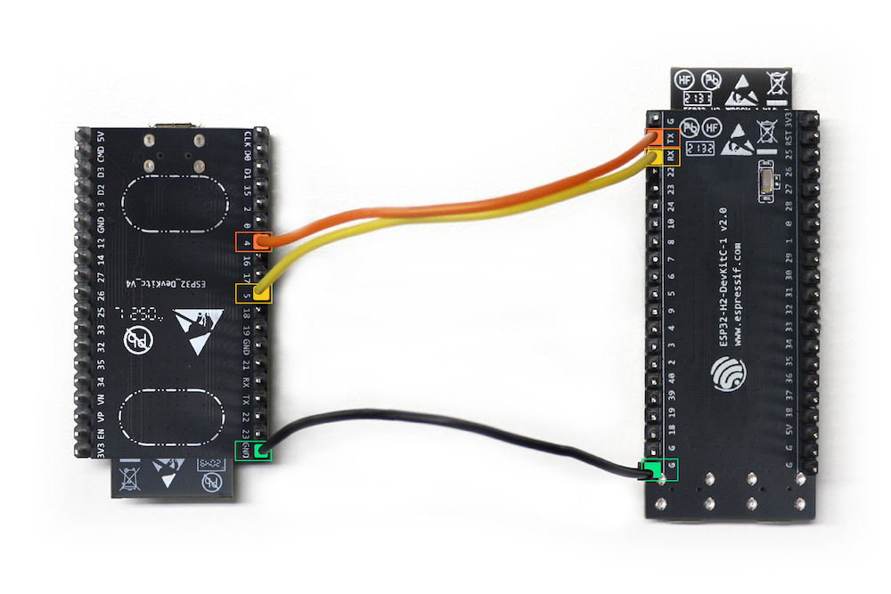

| Supported Targets | ESP32 | ESP32-C3 | ESP32-C6 | ESP32-S2 | ESP32-S3 | ESP32-C5 |
| ----------------- | ----- | -------- | -------- | -------- | -------- | -------- |

# Gateway Example

This example demonstrates how to build a Zigbee Gateway device. It runs on a Wi-Fi SoC such as ESP32, ESP32-C3 and ESP32-S3, with an 802.15.4 SoC like ESP32-H2
running [ot_rcp](https://github.com/espressif/esp-idf/tree/master/examples/openthread/ot_rcp) to provide 802.15.4 radio.

## Hardware Platforms

### Wi-Fi based ESP Zigbee Gateway

The Wi-Fi based ESP Zigbee Gateway consists of two SoCs:

* An ESP32 series Wi-Fi SoC (ESP32, ESP32-C, ESP32-S, etc) loaded with this example.
* An 802.15.4 enabled SoC (e.g., ESP32-H2 or ESP32-C6) loaded with [OpenThread RCP](https://github.com/espressif/esp-idf/tree/master/examples/openthread/ot_rcp) example.

#### ESP Zigbee Gateway Board

The ESP Zigbee gateway board provides an integrated module of an ESP32-S3 SoC and an ESP32-H2 RCP.


The two SoCs are connected with following interfaces:
* UART for serial communication
* RESET and BOOT pins for RCP Update
* 3-Wires PTA for RF coexistence

No jumper wires needed. No `idf.py menuconfig` under menu "ESP Zigbee gateway rcp update" configure to change.

#### Standalone Modules

The SDK also supports manually connecting an ESP32-H2 RCP to an ESP32 series Wi-Fi SoC. As one way of connection is following:

ESP32 pin     | ESP32-H2 pin
------------- |-------------
   GND        |    G
   GPIO4 (RX) |    TX
   GPIO5 (TX) |    RX
   GPI017     |    RST
   GPIO18     |    GPIO9(BOOT)

TX, RX, RST and BOOT pin from ESP32 side can be configured by user in `idf.py menuconfig` under menu "ESP Zigbee gateway rcp update".

TX, RX pins from ESP32-H2 should be configured in [ot_rcp example](https://github.com/espressif/esp-idf/tree/master/examples/openthread/ot_rcp) via "OpenThread RCP Example > Configure RCP UART pin manually" options.

Other pin number is also available for user to configure if needed.

The following image shows an example connection between ESP32 DevKitC and ESP32-H2 DevKitC:



## Erase the NVRAM 

Before flash it to the board, it is recommended to erase NVRAM if user doesn't want to keep the previous examples or other projects stored info 
using `idf.py -p PORT erase-flash`

## Create the RCP firmware image

The esp_zigbee_gateway supports updating the RCP image. Generate rcp image before building the esp_zigbee_gateway example.

Build the [ot_rcp](https://github.com/espressif/esp-idf/tree/master/examples/openthread/ot_rcp) example. Later in the esp_zigbee_gateway building process, the built RCP image will be automatically packed into the esp_zigbee_gateway firmware. See detail in [CMakeLists.txt](main/CMakeLists.txt).

Notes:
- `OPENTHREAD_NCP_VENDOR_HOOK` of `ot_rcp` should be selected via menuconfig.

## Build and Flash

Build the project, flash it to the board, and start the monitor tool to view the serial output by running `idf.py -p PORT flash monitor`

(To exit the serial monitor, type ``Ctrl-]``.)

## Application Functions

- When the program starts, the board will attempt to read the RCP version from the remote radio via UART.
```
I (433) main_task: Started on CPU0
I (443) main_task: Calling app_main()
I (453) ZIGBEE_GATEWAY: Start ESP Zigbee Stack
I (493) main_task: Returned from app_main()
I (503) RCP_UPDATE: RCP: using update sequence 0
I (503) ESP_RADIO_SPINEL: spinel UART interface initialization completed
I (503) ESP_RADIO_SPINEL: Spinel UART interface has been successfully enabled
I (503) ESP_ZIGBEE_RADIO_SPINEL_UART: Spinel UART interface enable successfully
I(513) OPENTHREAD:[I] P-SpinelDrive-: co-processor reset: RESET_POWER_ON
E(523) OPENTHREAD:[C] P-SpinelDrive-: Software reset co-processor successfully
I (573) ESP_ZIGBEE_RCP: Running RCP version: openthread-esp32/fcae32885b029-b945928d7; esp32h2;  2026-03-11 02:30:22 UTC
```

- If `CONFIG_ZIGBEE_GW_AUTO_UPDATE_RCP` is enabled and the version does not match the stored one, the board will automatically update the RCP using the stored version.

- After confirming that the remote radio is functioning properly, the board will connect to Wi-Fi as configured in menuconfig.
```

I (573) example_connect: Start example_connect.
I (583) pp: pp rom version: e7ae62f
I (583) net80211: net80211 rom version: e7ae62f
I (593) wifi:wifi driver task: 3fcb86d0, prio:23, stack:6656, core=0
I (593) wifi:wifi firmware version: 14da9b7
I (593) wifi:wifi certification version: v7.0
I (603) wifi:config NVS flash: enabled
I (603) wifi:config nano formatting: disabled
I (603) wifi:Init data frame dynamic rx buffer num: 32
I (613) wifi:Init static rx mgmt buffer num: 5
I (613) wifi:Init management short buffer num: 32
I (623) wifi:Init dynamic tx buffer num: 32
I (623) wifi:Init static tx FG buffer num: 2
I (633) wifi:Init static rx buffer size: 1600
I (633) wifi:Init static rx buffer num: 10
I (633) wifi:Init dynamic rx buffer num: 32
I (643) wifi_init: rx ba win: 6
I (643) wifi_init: accept mbox: 6
I (643) wifi_init: tcpip mbox: 32
I (653) wifi_init: udp mbox: 6
I (653) wifi_init: tcp mbox: 6
I (653) wifi_init: tcp tx win: 5760
I (663) wifi_init: tcp rx win: 5760
I (663) wifi_init: tcp mss: 1440
I (663) wifi_init: WiFi IRAM OP enabled
I (673) wifi_init: WiFi RX IRAM OP enabled
I (673) phy_init: phy_version 701,f4f1da3a,Mar  3 2025,15:50:10
W (673) phy_init: failed to load RF calibration data (0x1102), falling back to full calibration
I (783) phy_init: Saving new calibration data due to checksum failure or outdated calibration data, mode(2)
I (793) wifi:mode : sta (48:27:e2:14:43:38)
I (793) wifi:enable tsf
I (793) example_connect: Connecting to esp-guest...
W (793) wifi:Password length matches WPA2 standards, authmode threshold changes from OPEN to WPA2
I (803) example_connect: Waiting for IP(s)
I (3293) wifi:new:<6,0>, old:<1,0>, ap:<255,255>, sta:<6,0>, prof:1, snd_ch_cfg:0x0
I (3303) wifi:state: init -> auth (0xb0)
I (3303) wifi:state: auth -> assoc (0x0)
I (3323) wifi:state: assoc -> run (0x10)
I (3413) wifi:connected with esp-guest, aid = 1, channel 6, BW20, bssid = 84:78:48:86:87:31
I (3423) wifi:security: WPA2-PSK, phy: bgn, rssi: -30
I (3423) wifi:pm start, type: 1

I (3423) wifi:dp: 1, bi: 102400, li: 3, scale listen interval from 307200 us to 307200 us
I (3433) wifi:set rx beacon pti, rx_bcn_pti: 0, bcn_timeout: 25000, mt_pti: 0, mt_time: 10000
I (3453) wifi:AP's beacon interval = 102400 us, DTIM period = 1
I (3503) wifi:<ba-add>idx:0 (ifx:0, 84:78:48:86:87:31), tid:0, ssn:0, winSize:64
I (4573) example_connect: Got IPv6 event: Interface "example_netif_sta" address: fe80:0000:0000:0000:4a27:e2ff:fe14:4338, type: ESP_IP6_ADDR_IS_LINK_LOCAL
I (4843) esp_netif_handlers: example_netif_sta ip: 10.18.40.174, mask: 255.255.255.0, gw: 10.18.40.1
I (4843) example_connect: Got IPv4 event: Interface "example_netif_sta" address: 10.18.40.174
I (4843) example_common: Connected to example_netif_sta
I (4853) example_common: - IPv4 address: 10.18.40.174,
I (4853) example_common: - IPv6 address: fe80:0000:0000:0000:4a27:e2ff:fe14:4338, type: ESP_IP6_ADDR_IS_LINK_LOCAL
I (4863) wifi:Set ps type: 0, coexist: 0
```

- Finally, the board will act as the `Zigbee Gateway`, forming a network and handling commands from the network.
```
I (4883) ZIGBEE_GATEWAY: Initialize Zigbee stack
I (4883) ZIGBEE_GATEWAY: Deferred driver initialization successful
I (4883) ZIGBEE_GATEWAY: Device started up in factory-reset mode
I (5303) ZIGBEE_GATEWAY: Formed network successfully: PAN ID(0x4494, EXT: 0x6055f9fffef7a2ad), Channel(13), Short Address(0x0000)
I (5573) ZIGBEE_GATEWAY: Network(0x4494) is open for 180 seconds
I (5573) ZIGBEE_GATEWAY: Network steering completed
```

- Gateway functionalities supporting Wi-Fi interaction will be added in future updates.

## Troubleshooting

For any technical queries, please open an [issue](https://github.com/espressif/esp-zigbee-sdk/issues) on GitHub. We will get back to you soon
